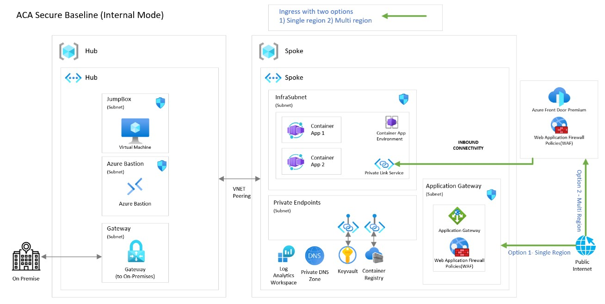

# Azure Container Apps landing zone accelerator

Azure landing zone accelerators provide architectural guidance, reference architectures, reference implementations, and automation to deploy workload platforms on Azure at scale. They are aligned with industry proven practices, such as those presented in [Azure landing zones](https://learn.microsoft.com/azure/cloud-adoption-framework/ready/landing-zone/) guidance in the Cloud Adoption Framework.

This Azure Container Apps landing zone accelerator represents the strategic design path and target technical state for an Azure Container Apps deployment, owned and operated by an workload team.

This repository provides packaged guidance for customer scenarios, reference architecture, reference implementation, tooling, design area guidance, sample application deployed after provisioning the infrastructure using the accelerator. The architectural approach can be used as design guidance for greenfield implementation and as an assessment for brownfield customers already using containerized apps.

## :mag: Design areas

The architecture is considered across four key design areas. Please review them as part of your overall understanding of this landing zone accelerator.

- [Identity and Access Management](/docs/design-areas/identity.md)
- [Network Topology and Connectivity](/docs/design-areas/networking.md)
- [Management and Monitoring](/docs/design-areas/management.md)
- [Security, Governance, and Compliance](/docs/design-areas/security.md)

## :rocket: Reference implementation

This repo contains the Azure landing zone accelerator's reference implementations, all with supporting *Infrastructure as Code* artifacts. The scenarios covered are:

:arrow_forward: [Scenario 1: Azure Container Apps - Internal environment secure baseline](scenarios/aca-internal/README.md)

*More reference implementation scenarios will be added as they become available.*

## Provide feedback

Please use GitHub issues if you have any feedback or requests on how we can improve these reference implementations.

## Data collection

The software may collect information about you and your use of the software and send it to Microsoft. Microsoft may use this information to provide services and improve our products and services. You may turn off the telemetry as described in the repository. There are also some features in the software that may enable you and Microsoft to collect data from users of your applications. If you use these features, you must comply with applicable law, including providing appropriate notices to users of your applications together with a copy of Microsoft's privacy statement. Our privacy statement is located at <https://go.microsoft.com/fwlink/?LinkId=521839>. You can learn more about data collection and use in the help documentation and our privacy statement. Your use of the software operates as your consent to these practices.

### Telemetry Configuration

Telemetry collection is *on* by default.

To opt-out, set `enableTelemetry` to `false` in the [Bicep parameter file](scenarios/aca-internal/bicep/main.parameters.jsonc).

## Contributing

We welcome contributions, please see our [Contribution guide](CONTRIBUTING.md) to learn how you can participate.

## Trademarks

This project may contain trademarks or logos for projects, products, or services. Authorized use of Microsoft trademarks or logos is subject to and must follow Microsoft's Trademark & Brand Guidelines. Use of Microsoft trademarks or logos in modified versions of this project must not cause confusion or imply Microsoft sponsorship. Any use of third-party trademarks or logos are subject to those third-party's policies.
