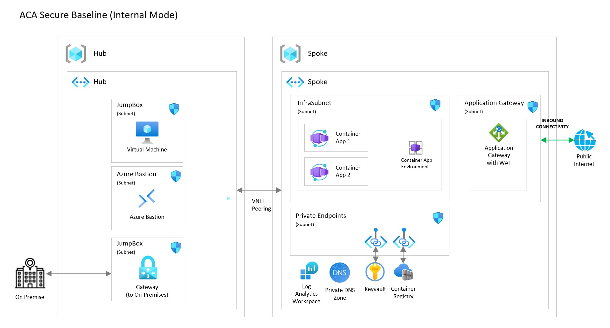

# Azure Container Apps Landing Zone Accelerator - Security

Security is a one of the foundational design principles and also a key design area that must be treated as a first-class concern within the architectural process. This ReadMe File provides design considerations and recommendations for Security when you use the Azure Container Apps landing zone accelerator.

---
### Design Area Considerations

- Cloud application security in enterprise environments is built in a layered approach. Microsoft provides recommendations for securing your application, as does the enterprise security organization governing cloud solutions. Finally, the solution developer has a responsibility to implement the appropriate security measures for the solution.
    - The [Container Apps security profile](https://learn.microsoft.com/security/benchmark/azure/baselines/azure-container-apps-security-baseline) from the Microsoft [Cloud Security Benchmark](https://learn.microsoft.com/security/benchmark/azure/overview) provides a good starting point
    - The [Azure Landing Zone security documentation](https://learn.microsoft.com/azure/cloud-adoption-framework/secure/), part of the Cloud Adoption Framework, provides an additional security view on Landing Zones.

- Azure Container Apps allows for _internal_ and _external_ connectivity models. This allows for connecting the Container Apps to the outside world directly or not at all. In this Landing Zone Accelerator, we recommend the _internal_ model and assume that the application will be either fully internal facing or will be published externally through a service that adds the appropriate security controls, such as Azure Application Gateway. The security architecture would then look as follows (the box with Application Gateway being optional in internal-facing scenarios):

- Security requirements may dictate the collection of certain logs or telemetry. Azure services offer diagnostic settings that enable the collection of platform metrics through Log Analytics or custom solutions. Application specific data-points may also be needed. These can also be collected using Log Analytics or Application Insights, but require the application to be properly instrumented. For this to be done, it is necessary to properly map these requirements before implementing the solution.

---
### Design Area Recommendations

- Cloud security is a journey, not a destination. Security should be a first-class concern in your solution design and software development processes. Architects must focus on objectives and key results when envisioning a security end-state and map concepts, frameworks, and standards to the disciplines in the CAF secure methodology.

- Use the Container Apps Security Profile and Azure Landing Zone security documentation as a starting point for securing your Container Apps

- Assess the security log collection requirements and implement the required data collection in the application and infrastructure

## References

- [Container Apps security profile](https://learn.microsoft.com/security/benchmark/azure/baselines/azure-container-apps-security-baseline)
- [Cloud Security Benchmark](https://learn.microsoft.com/security/benchmark/azure/overview)
- [Securing a custom VNET in Azure Container Apps](https://learn.microsoft.com/azure/container-apps/firewall-integration)
- [Azure Landing Zone security documentation](https://learn.microsoft.com/azure/cloud-adoption-framework/secure/)
  