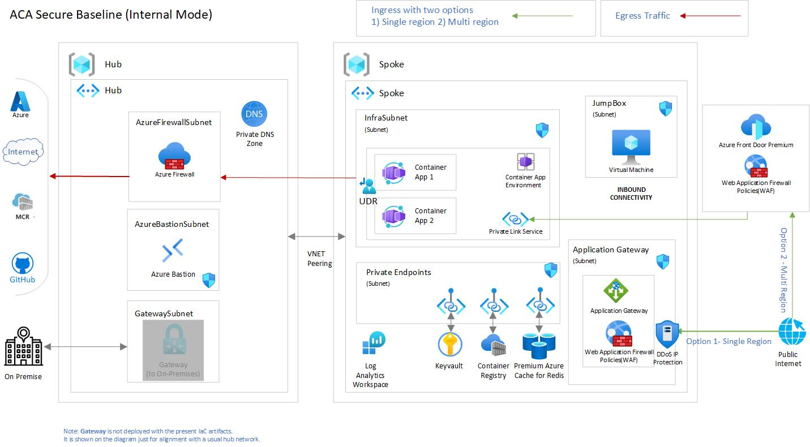

# Scenario 1: Azure Container Apps - Internal environment secure baseline

This reference implementation demonstrates a *secure baseline infrastructure architecture* for a microservices workload deployed into [Azure Container Apps](https://learn.microsoft.com/azure/container-apps). Specifically this scenario addresses deploying Azure Container Apps into a [virtual network](https://learn.microsoft.com/azure/container-apps/vnet-custom-internal), and has no public endpoint.

> :information_source: You can quickly deploy the current LZA directly in your Azure subscription by hitting the button below.
> 
> 

Azure Container Apps-hosted workloads typically experiences a separation of duties and lifecycle management in the area of prerequisites, the host network, the cluster infrastructure, and finally the workload itself. This reference implementation steps are created by keeping that in mind. Also, be aware our primary purpose is to illustrate the topology and decisions of a baseline cluster. We feel a "step-by-step" flow will help you learn the pieces of the solution and give you insight into the relationship between them Ultimately, lifecycle/SDLC management of your cluster and its dependencies will depend on your situation (team roles, organizational standards, tooling, etc), and must be implemented as appropriate for your needs.

By the end of this deployment guide, you would have deployed an "internal environment" Azure Container Apps cluster. You will also be deploying a sample web app. This implementation is not expected to be your first exposure to Azure Container Apps, if you're looking for introductory material, please complete the [Implement Azure Container Apps](https://learn.microsoft.com/training/modules/implement-azure-container-apps/) training module on Microsoft Learn.

## Core architecture components

- Azure Container Apps
- Azure Virtual Networks (hub-spoke)
- Azure Container Registry
- Azure Bastion
- Azure Firewall
- Route Table (User defined routing)
- Azure Application Gateway (with Web Application Firewall)
- Azure Standard Public IP (with [DDoS protection](https://learn.microsoft.com/azure/ddos-protection/ddos-protection-sku-comparison#skus))
- Azure Key Vault
- Azure Private Endpoint
- Azure Private DNS Zones
- Log Analytics Workspace
- Azure Cache for Redis (optional deployment, see [Deployment parameters](./bicep/README.md#standalone-deployment-guide), default is false)
- Azure Policy (both built-in and custom)

All resources have enabled their Diagnostics Settings (by default sending the logs to a Log Analytics Workspace).

All the resources that support Zone Redundancy (i.e. Container Apps Environment, Application Gateway, Standard IP) are set by default to be deployed in all Availability Zones. If you are planning to deploy to a region that is not supporting Availability Zones you need to set the  parameter  `deployZoneRedundantResources` to `false`.

Opted for [Azure Firewall Basic](https://learn.microsoft.com/azure/firewall/overview#azure-firewall-basic)  due to its cost-effective pricing model. This Architecture decision aligns with budgetary constraints while providing essential firewall functionalities. However, for enterprise usage we recommend a careful examination of Azure Firewall Basic SKU limitations. End users should be aware that [higher SKUs](https://learn.microsoft.com/azure/firewall/choose-firewall-sku#feature-comparison) may offer more robust functionalities for specific enterprise requirements.

Azure policies related to Azure Container Apps (both built-in but some custom as well) are applied to the spoke Resource Group by default. If you wish to skip Azure Policy Assignment, set the parameter `deployAzurePolicies` to `false`. 

## Deploy the reference implementation

This reference implementation is provided with the following infrastructure as code options. Select the deployment guide you are interested in. They both deploy the same implementation.

:arrow_forward: [Bicep-based deployment guide](./bicep)

:arrow_forward: [Terraform-based deployment guide](./terraform)

Alternatively, you can quickly deploy the current LZA directly in your Azure subscription by hitting the button below

