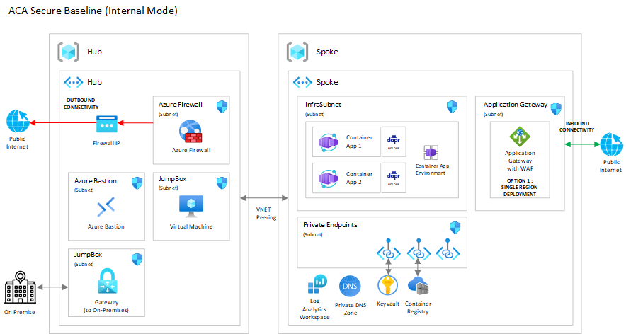

# ACA Internal

By the end of this, you would have deployed a ACA Internal Environment. We will also be deploying a nginx web app. Check out the [Introduction to Azure Container Apps on Azure](https://learn.microsoft.com/en-us/azure/container-apps/) Training path on Microsoft Learn  for some intermediate level training on ACA.

For this scenario, we will have various IaC technology that you can choose from depending on your preference. At this time only the Bicep versions are available. Below is an architectural diagram of this scenario.

## Core architecture components
*  TBD

## Next
Pick one of the IaC options below and follow the instructions to deploy the ACA reference implementation.
