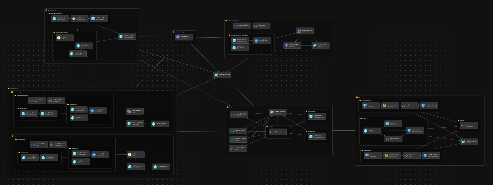

# Enterprise Scale for ACA - Private 

## Steps of Implementation for Applications on Azure Container Apps

A deployment of ACA-hosted workloads typically experiences a separation of duties and lifecycle management in the area of prerequisites, the host network, the cluster infrastructure, and finally the workload itself. This reference implementation steps are created by keeping that in mind. Also, be aware our primary purpose is to illustrate the topology and decisions of a baseline cluster. We feel a "step-by-step" flow will help you learn the pieces of the solution and give you insight into the relationship between them. Ultimately, lifecycle/SDLC management of your cluster and its dependencies will depend on your situation (team roles, organizational standards, tooling, etc), and must be implemented as appropriate for your needs.

## Accounting for Separation of Duties

While the code here is located in one folder in a single repo, the steps are designed to mimic how an organization may break up the deployment of various Azure components across teams, into different code repos or have them run by different pipelines with specific credentials.

Some organizations or end users of this LZA most possibly have already a Hub and Spoke topology. Each building block of the landing zone can be deployed by a different team, or even by different pipelines. The code here is designed to be modular and flexible to allow for that. You can easily adapt them to your own needs and requirements.

If you already have a hub or supporting services, you can bypass the creation of these building blocks and brind your own hub and supporting services. You can also deploy the hub and supporting services in a different subscription or resource group.

## Keeping It As Simple As Possible

The code here is purposely written to avoid loops, complex variables and logic. In most cases, it is resource blocks, small modules and limited variables, with the goal of making it easier to determine what is being deployed and how they are connected.

Resources are broken into 6 main building blocks for future modularization or adjustments as needed by your organization: hub, spoke, supporting services, container apps environment, Hello World sample app (optional) and application gateway. Front Door is also available as an alternative to Application Gateway.



Resource naming is always defined in `main.bicep` of each building block make it easier to find and adapt to your needs.

## Fast Deployment

On the contrary, if you want to deploy the complete landing zone in a single subscription, you can do so by using the main.bicep file in the root of this folder. If you want to deploy with one of the sample applications, you can find the documentation in the [sample-apps](./sample-apps) folder. Each application has its own bicep file and parameters file and describe how to deploy them in an existing landing zone or with a new one.

To deploy the complete landing zone, first review the parameters in [main.parameters.jsonc](./main.parameters.jsonc). Then you can use the following command to deploy the landing zone:

```azcli
az deployment sub create \
    --template-file main.bicep \
    --location <LOCATION> \
    --name <DEPLOYMENT_NAME> \
    --parameters ./main.parameters.jsonc
```
 Where `<LOCATION>` is the location where you want to deploy the landing zone and `<DEPLOYMENT_NAME>` is the name of the deployment.

## Complete Deployment Guide

This section is organized using folders that match the steps outlined below. Make any necessary adjustments to the variables and settings within that folder to match the needs of your deployment. Please read carrefully the documentation of each step before deploying it. All bicep templates parameters are documented in the bicep templates.

0. Preqs - Clone this repo, install [Azure CLI](https://docs.microsoft.com/en-us/cli/azure/install-azure-cli), install [Bicep tools](https://docs.microsoft.com/en-us/azure/azure-resource-manager/bicep/install)
1. [Hub](./01-hub)
2. [Spoke](./02-spoke)
3. [Supporting Services](./03-supporting-services)
4. [ACA Environment](./04-container-apps-environment)
5. [Hello World Sample Container App (Optional)](./05-hello-world-sample-app)
6. [Application Gateway](./06-application-gateway) or [Front Door](./06-azure-front-door)  

## Cleanup

To remove the resources created by this landing zone, you can use the following command:

```azcli
az group delete -n <RESOURCE_GROUP_NAME> --yes
```

Where `<RESOURCE_GROUP_NAME>` is the name of the resource group where the resources were deployed. For each resource group created by the landing zone: at least the hub and the spoke. You can also delete the resource group where the supporting services were deployed, if you created one.
