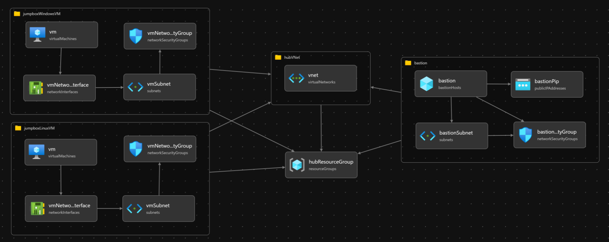

# Deploy the regional hub

This is the first step in the step-by-step deployment guide for the [Azure Container Apps - Internal environment secure baseline](../../README.md). This hub will be the egress point for all traffic in connected spokes.

## Networking in this architecture

Egressing your spoke traffic through a hub network (following the hub-spoke model), is a critical component of this architecture. Your organization's networking team will likely have a specific strategy already in place for this; such as a Connectivity subscription already configured for regional egress. In this walkthrough, we are going to implement this recommended strategy in an illustrative manner, however you will need to adjust based on your specific situation when you implement this cluster for production. Hubs are usually a centrally-managed and governed resource in an organization, and not typically workload specific. The steps that follow create the hub (and spokes) as a stand-in for the work that you'd coordinate with your networking team.

## Expected results

After executing these steps you'll have the hub resource group (`rg-lzaaca-hub-dev-reg`, by default) populated with a regional virtual network, Azure Bastion, and jump box virtual machines. Based on how you [configured the naming and deployment parameters](../../README.md#steps), your result may be slightly different. No spokes will have been created yet.



### Resources

- Hub resource group
- Hub virtual network
- Azure Bastion (optional)
- Jump box virtual machine (optional)

### IP addressing

Since this walkthrough is expected to be deployed isolated from existing infrastructure and not joined to any of your existing networks; the IP addresses should not come in conflict with any existing networking you have, even if those IP addresses overlap with ones you already have in your enterprise. However, if you need to join existing networks, even for the purposes this walkthrough, you'll need to adjust the IP space before deploying. See [Review and update deployment parameters](../../README.md#steps).

## Steps

1. Navigate to the Bicep modules.

   ```bash
   cd modules
   ```

1. Set the desired region for the whole reference implementation.

   :stop_sign: Update this to your desired region.

   ```bash
   LOCATION=northeurope # or any location that suits your needs
   ```

1. Create the regional network hub.

   ```bash
   # [This takes about seven minutes to run.]
   az deployment sub create \
      -n acalza01-hub \
      -l $LOCATION \
      -f 01-hub/deploy.hub.bicep \
      -p 01-hub/deploy.hub.parameters.jsonc
   ```

## Next step

:arrow_forward: [Create the spoke network](../02-spoke/README.md)
