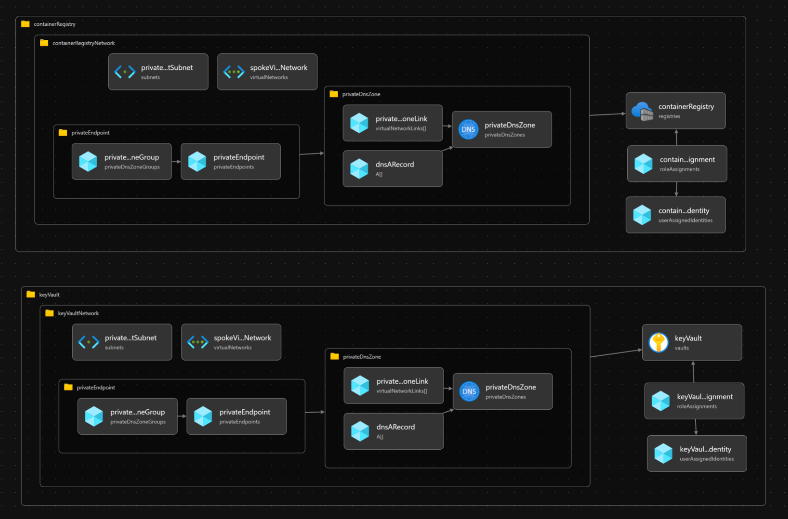

# Deploy the long-lifecycle resources

At this point, you have a [spoke virtual network](../02-spoke/README.md) ready to land your workload into. However, workloads have resources that live on different lifecycle cadences. Here you'll be deploying the resources that have a lifecycle longer than any of your application platform components.

## Expected results

Workloads often have resources that exist on different lifecycles. Some are singletons, and not tied to the deployment stamp of the application platform. Others come and go with the application platform and are part of the application's stamp. Yet others might even be tied to the deployment of code within the application platform. In this deployment, you'll be deploying resources that are not expected to be tied to the same lifecycle as the instance of the Azure Container App, and are in fact dependencies for any given instance and could be used by multiple instances if you had multiple stamps.



### Resources

- Azure Container Registry
- Azure Key Vault
- Private Link for each, including related DNS Private Zone configuration
- User managed identities for the workload

By default, they are deployed to the spoke resource group.

## Steps

1. Create the regional resources that the Azure Container Apps platform and its applications will be dependant on.

   ```bash
   RESOURCEID_VNET_HUB=$(az deployment sub show -n acalza01-hub --query properties.outputs.hubVNetId.value -o tsv)
   RESOURCENAME_RESOURCEGROUP_SPOKE=$(az deployment sub show -n acalza01-spokenetwork --query properties.outputs.spokeResourceGroupName.value -o tsv)
   RESOURCEID_VNET_SPOKE=$(az deployment sub show -n acalza01-spokenetwork --query properties.outputs.spokeVNetId.value -o tsv)
   echo RESOURCEID_VNET_HUB: $RESOURCEID_VNET_HUB && \
   echo RESOURCENAME_RESOURCEGROUP_SPOKE: $RESOURCENAME_RESOURCEGROUP_SPOKE && \
   echo RESOURCEID_VNET_SPOKE: $RESOURCEID_VNET_SPOKE

   # [This takes about four minutes to run.]
   az deployment group create \
      -n acalza01-dependencies \
      -g $RESOURCENAME_RESOURCEGROUP_SPOKE \
      -f 03-supporting-services/deploy.supporting-services.bicep \
      -p 03-supporting-services/deploy.supporting-services.parameters.jsonc \
      -p hubVNetId=${RESOURCEID_VNET_HUB} spokeVNetId=${RESOURCEID_VNET_SPOKE}
   ```

## Private DNS Zones

Private DNS zones in this reference implementation are implemented directly at the spoke level, meaning the workload team creates the private link DNS zones & records for the resources needed; furthermore, the workload is directly using Azure DNS for resolution. Your networking topology might support this decentralized model or instead DNS & DNS zones for Private Link might be handed at the regional hub or in a [VWAN virtual hub extension](https://learn.microsoft.com/azure/architecture/guide/networking/private-link-vwan-dns-virtual-hub-extension-pattern) by your networking team.

If your organization operate a centralized DNS model, you'll need to adapt how DNS zones records are managed this implementation into your existing enterprise networking DNS zone strategy. Since this reference implementation is expected to be deployed isolated from existing infrastructure; this is not something you need to address now; but will be something to understand and address when taking your solution to production.

## Next step

:arrow_forward: [Deploy Azure Container Apps environment](../04-container-apps-environment/README.md)
