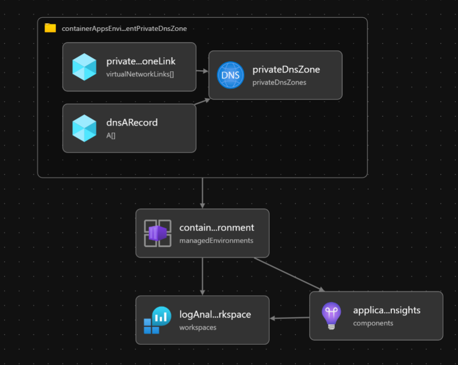

# Container Apps Environment

The following will be created:

* Container Apps Environment Environment 
* Log Analytics Workspace
* Application Insights (Optional)
* Dapr Telemetry with Application Insights (Optional)
* Private DNS Zone for Container Apps Environment



Review `deploy.aca-environment.parameters.jsonc` and update the values as required. Once the files are updated, deploy using az cli or Az PowerShell.

## [CLI](#tab/CLI)

```azurecli
az deployment group create -n <DEPLOYMENT_NAME> \
    -g <SPOKE_RESOURCE_GROUP> \
    -f deploy.aca-environment.bicep \
    -p deploy.aca-environment.parameters.jsonc 
```

Where `<DEPLOYMENT_NAME>` is the name of the deployment and `<SPOKE_RESOURCE_GROUP>` is the name of the spoke resource group.

## [PowerShell](#tab/PowerShell)

```azurepowershell
New-AzResourceGroupDeployment -ResourceGroupName "<SPOKE_RESOURCE_GROUP>" -TemplateFile deploy.aca-environment.bicep -TemplateParameterFile deploy.aca-environment.parameters.jsonc -Name <DEPLOYMENT_NAME>
```

Where `<DEPLOYMENT_NAME>` is the name of the deployment and `<SPOKE_RESOURCE_GROUP>` is the name of the spoke resource group.

:arrow_forward: [Hello World Sample Container App (Optional)](../05-hello-world-sample-app)
