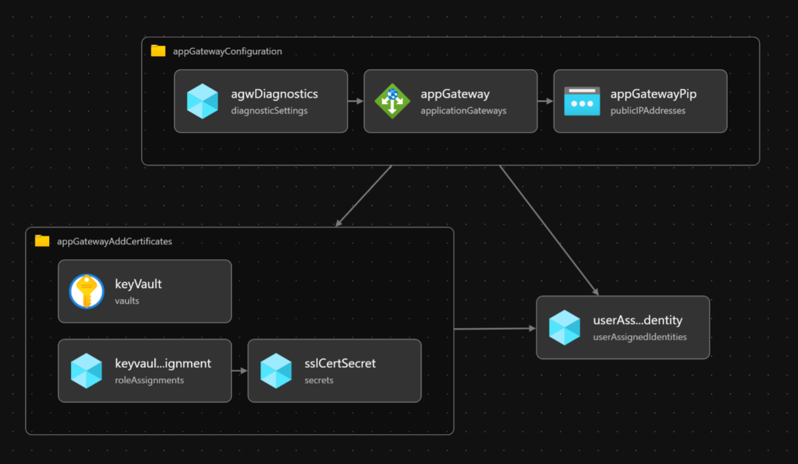
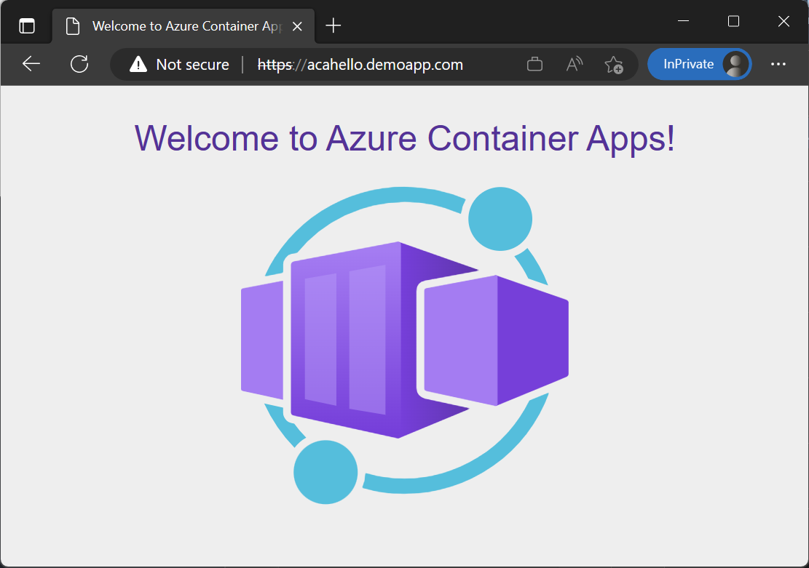

# Expose the workload through Application Gateway

The [workload that was deployed](../05-hello-world-sample-app/README.md) in the prior step needs to be exposed through a controlled gateway to reachable. Here, you'll deploy and configure Azure Application Gateway to serve that role.

## Expected results

The "Hello World" container app is exposed through Application Gateway, including with a TLS certificate that is stored in Key Vault. The cert is pre-generated.



### Resources

- Application Gateway with public IP
- SSL Certificate in Key Vault of the supporting services
- User Assigned Managed Identity for Application Gateway to access the secret in the Key Vault

## Steps

1. Deploy and configure Application Gateway with TLS

   ```bash
   RESOURCENAME_RESOURCEGROUP_SPOKE=$(az deployment sub show -n acalza01-spokenetwork --query properties.outputs.spokeResourceGroupName.value -o tsv)
   RESOURCEID_SUBNET_APPGW=$(az deployment sub show -n acalza01-spokenetwork --query properties.outputs.spokeApplicationGatewaySubnetId.value -o tsv)
   FQDN_HELLOWORLD_ACA=$(az deployment group show -g rg-lzaaca-spoke-dev-eus2 -n acalza01-helloworld --query properties.outputs.helloWorldAppFqdn.value -o tsv)
   RESOURCEID_KEYVAULT=$(az deployment group show -g rg-lzaaca-spoke-dev-eus2 -n acalza01-dependencies --query properties.outputs.keyVaultId.value -o tsv)
   echo RESOURCENAME_RESOURCEGROUP_SPOKE: $RESOURCENAME_RESOURCEGROUP_SPOKE && \
   echo RESOURCEID_SUBNET_APPGW: $RESOURCEID_SUBNET_APPGW && \
   echo FQDN_HELLOWORLD_ACA: $FQDN_HELLOWORLD_ACA && \
   echo RESOURCEID_KEYVAULT: $RESOURCEID_KEYVAULT
   
   # [This takes about six minutes to run.] 
   az deployment group create \
      -n acalza01-appgw \
      -g $RESOURCENAME_RESOURCEGROUP_SPOKE \
      -f 06-application-gateway/deploy.app-gateway.bicep \
      -p 06-application-gateway/deploy.app-gateway.parameters.jsonc \
      -p applicationGatewaySubnetId=${RESOURCEID_SUBNET_APPGW} applicationGatewayPrimaryBackendEndFqdn=${FQDN_HELLOWORLD_ACA} keyVaultId=${RESOURCEID_KEYVAULT}
   ```

1. Get the public IP of Application Gateway.

   ```bash
   IP_APPGW=$(az deployment group show -g rg-lzaaca-spoke-dev-eus2 -n acalza01-appgw --query properties.outputs.applicationGatewayPublicIp.value -o tsv)
   echo $IP_APPGW
   ```

1. Add a host file entry. *Optional.*

   Application gateway was configured to use a TLS certificate on it's listener.  For the best experience we recommend you add a host file entry to facilitate a more realistic experience.

   `<IP_APPGW from prior step>    acahello.demoapp.com`

1. Access the "Hello World" application running in Azure Container Apps.

   Using your browser either navigate to **https://\<IP_APPGW from prior step>** from above, or if you added the host file entry, to **<https://acahello.demoapp.com>**. *Because the cert is self-signed for this walkthrough, you will need to accept the security warnings presented by your browser.*

   **Never use this certificate in production.**

   

## Next step

:broom: When you are done exploring the reference implementation, be sure to [clean up your resources](../../README.md#broom-clean-up-resources) to ensure you don't spend more than necessary.
