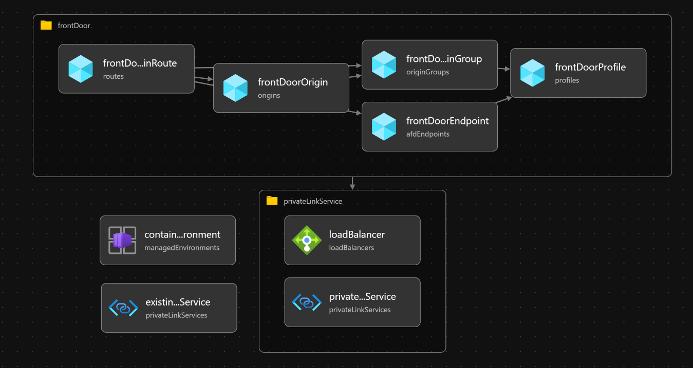

# Front Door

The following will be created:
* Private link Endpoints for Front Door
* Front Door endpoint for the container apps



Review `deploy.front-door.parameters.jsonc` and update the values as required. Once the files are updated, deploy using az cli or Az PowerShell.

| **Parameters** | **Type** | **Description** | **Required** |
| --- | --- | --- | --- | --- |
| containerAppsEnvironmentId | **string** | Container Apps Environment Resource ID | **Yes** |
| privateLinkSubnetId | **string** | Subnet ID of the private link NAT Subnet | **Yes** |
| frontDoorEndpointName | **string** | Desired Front Door Endpoint Name | **Yes** |
| frontDoorOriginHostName | **string** | Container Apps FQDN | **Yes** |

> **_NOTE:_**  Following Front Door creation, you will need to approve the private link endpoints. This can be done by navigating to the private link endpoint in the portal and clicking on the `Approve` button.


## [CLI](#tab/CLI)

```azurecli
az deployment group create -n <DEPLOYMENT_NAME> -g <SPOKE_RESOURCE_GROUP> -f deploy.front-door.bicep -p deploy.front-door.parameters.jsonc
```

Where `<DEPLOYMENT_NAME>` is the name of the deployment and `<SPOKE_RESOURCE_GROUP>` is the name of the spoke resource group.

## [PowerShell](#tab/PowerShell)

```azurepowershell
New-AzResourceGroupDeployment -ResourceGroupName "<SPOKE_RESOURCE_GROUP>" -TemplateFile deploy.front-door.bicep -TemplateParameterFile deploy.front-door.parameters.jsonc -Name <DEPLOYMENT_NAME>
```

Where `<DEPLOYMENT_NAME>` is the name of the deployment and `<SPOKE_RESOURCE_GROUP>` is the name of the spoke resource group.
