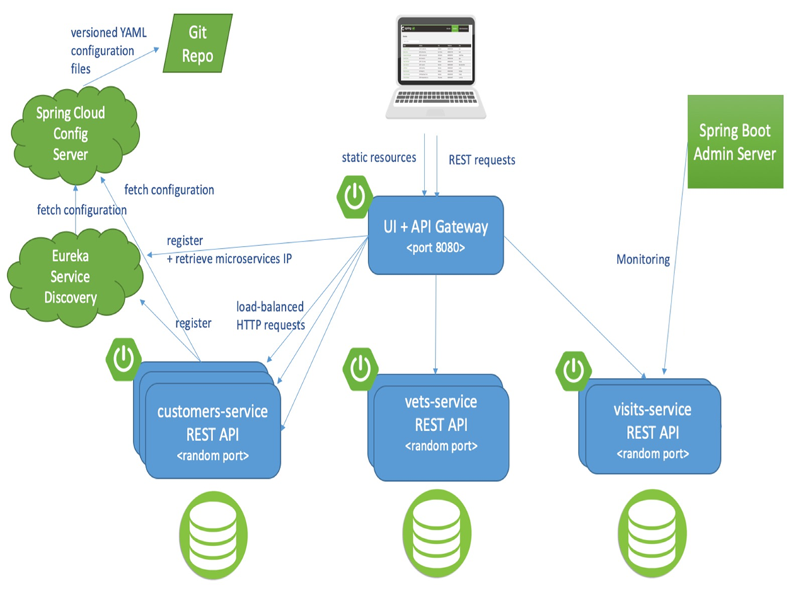

# # Sample App: Spring Petclinic Microservices

Spring Petclinic Microservices is a Java microservice application that simulates a pet clinic management system.

The application allows users to manage information about pets, their owners, and visits to the clinic. It is built using Spring Boot and follows a microservices architecture.

The sample app is available [here](https://github.com/azure-samples/spring-petclinic-microservices). The branch used for this scenario is [main](https://github.com/azure-samples/spring-petclinic-microservices/tree/main).

## Overview

The Spring Petclinic Microservices sample app consists of several microservices:

* `customers-service`
* `vets-service`
* `visits-service`
* `api-gateway`

Interaction/communication between these microservices is described below:

## Deployment

The deployment of the sample app is done in 2 steps:

1. :arrow_forward: [Deploy the landing zone](./docs/01-landing-zone.md)
2. :arrow_forward: [Create the container apps](./docs/02-container-apps.md)
2. :arrow_forward: [Connect the container apps with MySql DB](./docs/03-connect-to-db.md)
2. :arrow_forward: [Deploy the PetClinic microservices](./docs/04-deploy-apps.md)
