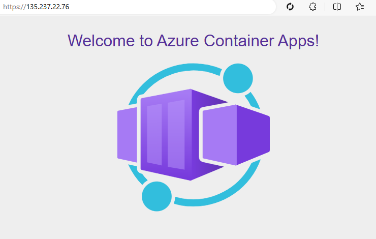

# Create the Container Apps with supporting services

Once the landing zone is deployed, the container apps environment and their dependencies are already set up in the private networking environment.

## Expected results
This documentation guides how to deploy the container apps and connect them with the created supporting services. 

## Resources

- Azure Database for MySQL flexible server.
- Azure Container Apps Java components
    - [Eureka Server](https://learn.microsoft.com/en-us/azure/container-apps/java-eureka-server?tabs=azure-cli) 
    - [Config Server](https://learn.microsoft.com/en-us/azure/container-apps/java-config-server?tabs=azure-cli)
- Azure Container Apps
- Connect Azure Container Apps to the Eureka Server and Config Server.
- Connect Azure Container Apps to MySQL flexible server and Azure Container Registry with User Assigned Identity.

## Steps

1. Go to the sample application folder as work directory

   ```bash
   cd ../sample-apps/PCF-spring-boot
   ```

1. Retrieve the Networking and Azure Container Registry information from previous deployment.

  ```bash
    RESOURCENAME_RESOURCEGROUP_SPOKE=$(az deployment sub show -n acalza01-spokenetwork --query properties.outputs.spokeResourceGroupName.value -o tsv)
    ENVIRONMENT_NAME=$(az deployment group show -n acalza01-appplat -g $RESOURCENAME_RESOURCEGROUP_SPOKE --query properties.outputs.containerAppsEnvironmentName.value -o tsv)
    RESOURCEID_IDENTITY_ACR=$(az deployment group show -n acalza01-dependencies -g $RESOURCENAME_RESOURCEGROUP_SPOKE --query properties.outputs.containerRegistryUserAssignedIdentityId.value -o tsv)
    REGISTRYNAME_ACR=$(az deployment group show -n acalza01-dependencies -g $RESOURCENAME_RESOURCEGROUP_SPOKE --query properties.outputs.containerRegistryName.value -o tsv)
    LOGINSERVER_ACR=$(az deployment group show -n acalza01-dependencies -g $RESOURCENAME_RESOURCEGROUP_SPOKE --query properties.outputs.containerRegistryLoginServer.value -o tsv)
    RESOURCEID_VNET_HUB=$(az deployment sub show -n acalza01-hub --query properties.outputs.hubVNetId.value -o tsv)
    RESOURCEID_VNET_SPOKE=$(az deployment sub show -n acalza01-spokenetwork --query properties.outputs.spokeVNetId.value -o tsv)

    echo RESOURCENAME_RESOURCEGROUP_SPOKE: $RESOURCENAME_RESOURCEGROUP_SPOKE && \
    echo ENVIRONMENT_NAME: $ENVIRONMENT_NAME && \
    echo RESOURCEID_IDENTITY_ACR: $RESOURCEID_IDENTITY_ACR && \
    echo REGISTRYNAME_ACR: $REGISTRYNAME_ACR && \
    echo LOGINSERVER_ACR: $LOGINSERVER_ACR && \
    echo RESOURCEID_VNET_HUB: $RESOURCEID_VNET_HUB && \
    echo RESOURCEID_VNET_SPOKE: $RESOURCEID_VNET_SPOKE
  ```

1. Import a wellknown hello world image to the private Azure Container Registry for further deploy. This hello world image will help to verify the resource creation.

   ```bash
   az acr import -n ${REGISTRYNAME_ACR} --source mcr.microsoft.com/azuredocs/containerapps-helloworld:latest
   ```

1. Create the desired resources
  
   ```bash
    az deployment group create -n acalza01-appplat-java -g $RESOURCENAME_RESOURCEGROUP_SPOKE \
        -f main.bicep \
        -p deploy.spring-petclinic-microservices.jsonc \
        -p spokeVnetId=${RESOURCEID_VNET_SPOKE} \
        -p hubVnetId=${RESOURCEID_VNET_HUB} \
        -p managedEnvironmentsName=${ENVIRONMENT_NAME} \
        -p acrIdentityId=${RESOURCEID_IDENTITY_ACR} \
        -p acrRegistry=${LOGINSERVER_ACR}
   ```

1. Retrieve the FQDN of the microservices

   ```bash
   FQDN=$(az deployment group show -g $RESOURCENAME_RESOURCEGROUP_SPOKE -n acalza01-appplat-java --query properties.outputs.fqdn.value -o tsv)
   ```

1. Create the Application Gateway that connect to the microservices. Replace the environment variable `FQDN_HELLOWORLD_ACA=$FQDN` when creating the Application Gateway. Tutorial can be viewed at [06-application-gateway](../../../modules/06-application-gateway/README.md). Note to change the working directory when creating the Application Gateway.

  ```bash
  cd ../../modules
  ```

## Verification

1. Go to the sample application folder as work directory

   ```bash
   cd ../sample-apps/PCF-spring-boot
   ```

1. Get the public IP of Application Gateway.

   ```bash
   IP_APPGW=$(az deployment group show -g $RESOURCENAME_RESOURCEGROUP_SPOKE -n acalza01-appgw --query properties.outputs.applicationGatewayPublicIp.value -o tsv)
   echo $IP_APPGW
   ```

1. Access the "Hello World" application running in Azure Container Apps.

   Using your browser either navigate to **https://\<IP_APPGW from prior step>** from above, or if you added the host file entry, to **<https://acahello.demoapp.com>**. *Because the cert is self-signed for this walkthrough, you will need to accept the security warnings presented by your browser.*

   

## Next step

:arrow_forward: [Connect Container Apps with MySql Flexible Server](./03-connect-to-db.md)
