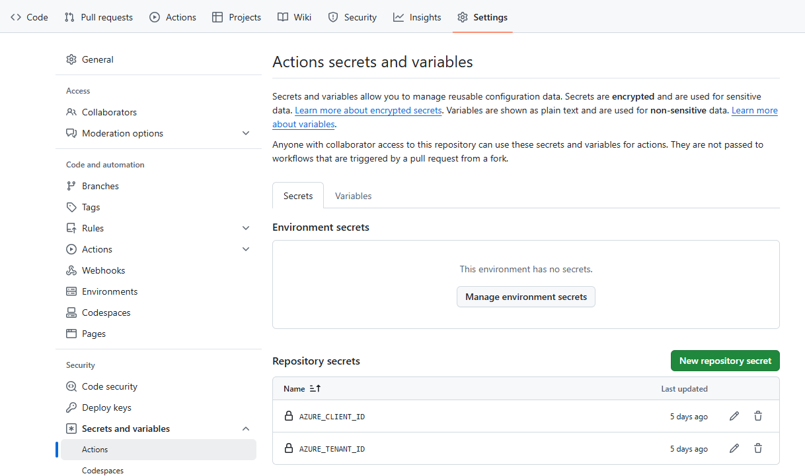

# Setup CI/CD Pipeline

With the application code already deployed to Azure Container Apps, the next step is to establish a CI/CD pipeline. This pipeline will automate the process of streaming subsequent code changes directly to Azure Container Apps. This setup ensures that every update is seamlessly integrated and deployed, enhancing efficiency and reducing manual effort.

## Expected Results

Setting up a GitHub Action for a CI/CD pipeline to deploy code changes to Azure Container Apps streamlines the development process, ensuring rapid and reliable delivery of updates.

## Steps

1. Create the Identity Used by GitHub Actions.
   ```bash
   APPID_GITHUB_ACTION=$(az ad app create --display-name github-action --query appId -o tsv)
   az ad sp create --id $APPID_GITHUB_ACTION
   ```

1. To allow the Application authenticate to Azure, set up the [federated identity credential](https://learn.microsoft.com/en-us/graph/api/resources/federatedidentitycredentials-overview?view=graph-rest-1.0). 
   First, update `[Your-GitHub-Organization]` and `[Your-Release-Branch]` to the [federated-credential.json](../modules/federated-credential.json).

   ```bash
   az ad app federated-credential create --id $APPID_GITHUB_ACTION --parameters modules/federated-credential.json
   ```

1. Assign your application necessary role to run the CI/CD pipeline.

  Retrieve your spoke resource group id
   ```bash
   RESOURCEID_RESOURCEGROUP_SPOKE=$(az group show -n $RESOURCENAME_RESOURCEGROUP_SPOKE --query id -o tsv)
   echo RESOURCEID_RESOURCEGROUP_SPOKE=$RESOURCEID_RESOURCEGROUP_SPOKE
   ```
   
   Open [modules/role-definition.json](../modules/role-definition.json), update `Your-Spoke-Resource-Group-Id` to your `RESOURCEID_RESOURCEGROUP_SPOKE`.

   ```bash
   ID_ROLEDEFINITION=$(az role definition create --role-definition @modules/role-definition.json --query id -o tsv)
   az role assignment create --role $ID_ROLEDEFINITION --scope $RESOURCEID_RESOURCEGROUP_SPOKE --assignee $APPID_GITHUB_ACTION
   ```

1. Prepare variable settings in GitHub repository by setting the Azure information to repository.

   ```bash
   AZURE_TENANT_ID=$(az account show --query tenantId -o tsv)
   AZURE_SUBSCRIPTION_ID=$(az account show --query id -o tsv)
   echo AZURE_CLIENT_ID=$APPID_GITHUB_ACTION && \
        AZURE_TENANT_ID=$AZURE_TENANT_ID && \
        AZURE_SUBSCRIPTION_ID=$AZURE_SUBSCRIPTION_ID && \
        AZURE_RESOURCE_GROUP=$RESOURCENAME_RESOURCEGROUP_SPOKE
   ```
   Navigate to the GitHub repository setting page, select `Security`/`Secrets and variables`/`Actions`. Set the `AZURE_CLIENT_ID` and `AZURE_TENANT_ID` to the secrets, `AZURE_SUBSCRIPTION_ID` and `AZURE_RESOURCE_GROUP` to the variables, according to above output.

   

1. Create the workflow file.
   Edit the [petclinic-deploy.yml](../modules/petclinic-deploy.yml), replace `[Your-Release-Branch-Name]` to your working branch. It should be consistent with the value set in step 2.
   Move the [petclinic-deploy.yml](../modules/petclinic-deploy.yml) to [.github/workflows](../../../../../../.github/workflows/) folder, commit the changes and push to remote your working branch.

1. Navigate to GitHub Actions page and check the running state of the workflow.

  

## Next step

:arrow_forward: [Update Spring Cloud dependencies](./06-Update-Spring-Cloud-dependencies.md)