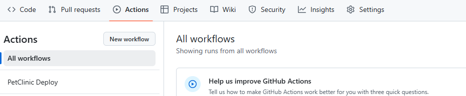

# Update Spring Cloud dependencies

As the given PetClinic Microservices previously were deployed on Pivotal Cloud Foundry. They uses the Pivotal Spring Cloud dependencies to interact with Config Server and Service Registry. After migrate to Azure Container Apps, when interacting with [Java components](https://techcommunity.microsoft.com/t5/apps-on-azure-blog/announcing-the-general-availability-of-java-experiences-on-azure/ba-p/4238294), you can change the dependencies to the community version.

## Expected Results

The PetClinic Microservices uses community version dependencies to talk with Spring Cloud Config Server and Eureka Server.

## Steps

1. Remove the `spring-cloud-services-dependencies`.
   Navigate to [src/pom.xml](../src/pom.xml) and remove the `spring-cloud-services-dependencies`

    ```diff
    -   <dependency>
    -      <groupId>io.pivotal.spring.cloud</groupId>
    -      <artifactId>spring-cloud-services-dependencies</artifactId>
    -      <version>${spring-cloud-services.version}</version>
    -      <type>pom</type>
    -      <scope>import</scope>
    -   </dependency>
    ```

1. Replace the Config Server dependency and Service Registry dependency.
   Update the follow pom files:
   - [src/spring-petclinic-api-gateway/pom.xml](../src/spring-petclinic-api-gateway/pom.xml)
   - [src/spring-petclinic-customers-service/pom.xml](../src/spring-petclinic-customers-service/pom.xml)
   - [src/spring-petclinic-vets-service/pom.xml](../src/spring-petclinic-vets-service/pom.xml)
   - [src/spring-petclinic-visits-service/pom.xml](../src/spring-petclinic-visits-service/pom.xml)

    ```diff
        <dependency>
    -       <groupId>io.pivotal.spring.cloud</groupId>
    -       <artifactId>spring-cloud-services-starter-config-client</artifactId>
    +       <groupId>org.springframework.cloud</groupId>
    +       <artifactId>spring-cloud-config-client</artifactId>
        </dependency>
        <dependency>
    -       <groupId>io.pivotal.spring.cloud</groupId>
    -       <artifactId>spring-cloud-services-starter-service-registry</artifactId>
    +       <groupId>org.springframework.cloud</groupId>
    +       <artifactId>spring-cloud-starter-netflix-eureka-client</artifactId>
        </dependency>
    ```

1. Commit and push above changes to remote and trigger the pipeline.

1. Navigate to GitHub Actions page and check the running state of the workflow.

  

1. After the pipeline successfully finished, view your application.

   Using your browser either navigate to **https://\<IP_APPGW>** from above, or if you added the host file entry, to **<https://acahello.demoapp.com>**. *Because the cert is self-signed for this walkthrough, you will need to accept the security warnings presented by your browser.*