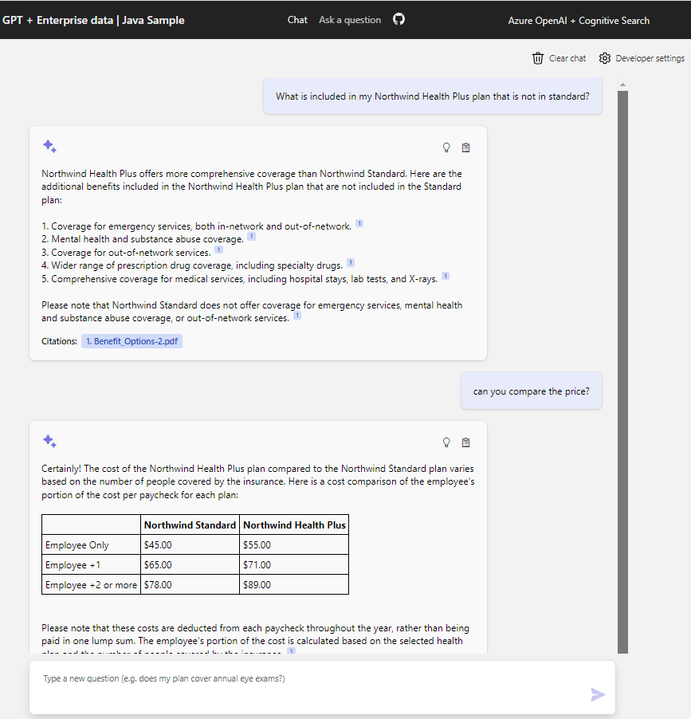
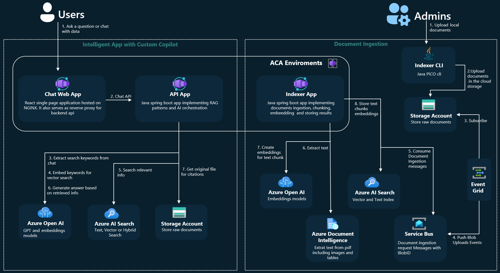
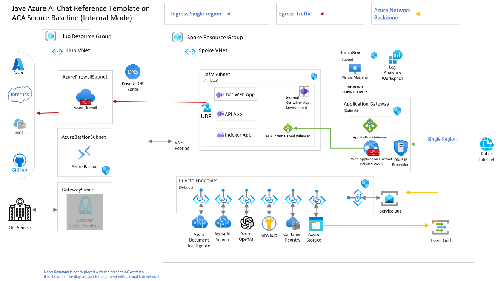
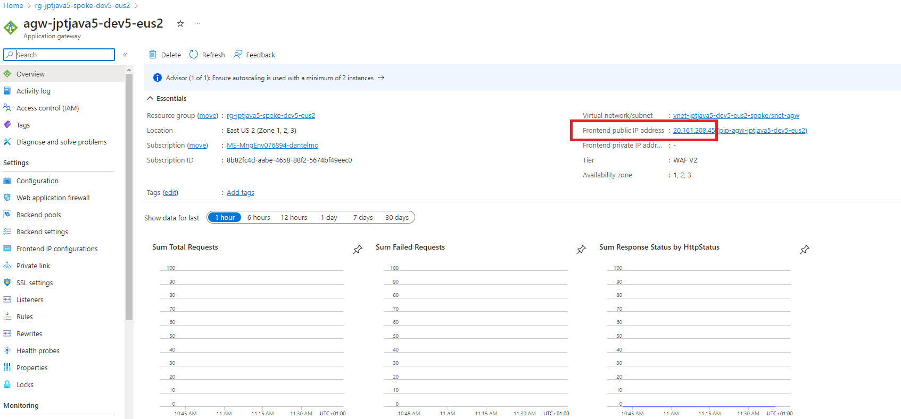

# Build and Deploy Intelligent Apps to Azure Container Apps - Java Azure AI Reference Template Guidance 

## App Overview
This sample is a complete end-to-end solution demonstrating the [Retrieval-Augmented Generation (RAG)](https://learn.microsoft.com/en-us/azure/search/retrieval-augmented-generation-overview) pattern running in Azure, using Azure AI Search for retrieval and Azure OpenAI large language models to power ChatGPT-style and Q&A experiences.

It's based on the [Java Azure AI reference template](https://github.com/Azure-Samples/azure-search-openai-demo-java) which provides you with well-maintained, easy to deploy reference implementation.This ensure a high-quality starting point for your intelligent applications developed with Java. The building blocks are smaller-scale samples that focus on specific scenarios and tasks.

The business scenario showcased in the sample is a B2E intelligent chat app to help employees answer questions about company benefits plan, internal policies, as well as job descriptions and roles. The repo includes sample pdf documents in the data folder so it's ready to try end to end.
Futhermore it provides:
* Chat and Q&A interfaces
* Various options to help users evaluate the trustworthiness of responses with citations, tracking of source content, etc.
* Possible approaches for data preparation, prompt construction, and orchestration of interaction between model (ChatGPT) and retriever (Azure AI Search)
* Possible AI orchestration implementation using the plain Java Open AI sdk or the Java Semantic Kernel sdk
* Settings directly in the UX to tweak the behavior and experiment with options

## App Architecture

The java Azure AI reference template supports different architectural styles. It can be deployed as standalone app on top of Azure App Service or as a microservice event driven architecture hosted by Azure Container Apps. Below you can see the architecture of the microservice event driven architecture:

* The API app is implemented as springboot 2.7.x app using the Microsoft JDK. It provides the ask and chat apis which are used by the chat web app. It's responsible for implementing the RAG pattern orchestrating the interaction between the LLM model (Open AI - ChatGPT) and the retriever (Azure AI Search).
* The Chat Web App is built in React and deployed as a static web app on nginx. Furthermore Nginx act as reverse proxy for api calls to the API app. This also solves the CORS issue.
* The indexer APP is implemented as springboot 2.7.x app using the Microsoft JDK. It is responsible for indexing the data into Azure AI Search and it's triggered by new BlobUploaded messages from serviceBus. The indexer is also responsible for chunking the documents into smaller pieces, embed them and store them in the index. Azure Document Intelligence is used to extract text from PDF documents (including tables and images)
* Azure AI Search is used as RAG retrieval system. And different search options are available: you have traditional full text (with semantic search) search, or vector based search and finally you can opt for hybrid search which brings together the best of the previous ones.
* EventGrid System topic is used to implement a real time mechanism to trigger the indexer app when a new document is uploaded to the blob storage. It's responsible to read BlobUploaded notification from azure storage container and push a message to the service bus queue containing the blob url.

## Deployment Architecture

The java Azure AI reference template is deployed on top of the ACA LZA 'internal scenario' infrastructure. Furthermore the Azure services required to implement the E2E chat with your data solution, are deployed following the LZA security, monitoring, networking and operational best practices.

### Networking
The deployment is based on the hub-and-spoke network topology. The hub network contains the shared services and the spoke network contains the application resources.The spoke network is also connected to the hub network through a virtual network peering. The virtual network peering is used to allow the application resources to access the shared services in the hub network. ACA is deployed as internal in a dedicated spoke vnet subnet and the web frontend app is exposed on the public internet through an Azure Application Gateway. All the other services are not exposed to the public internet and are accessible only from the internal network through private endpoints and private DNS Zones. For more information on the networking best practices implemented in the ACA internal scenario see [here](../../../../../../docs/design-areas/networking.md).

### Security
All the traffic is secured within the LZA hub and spoke networks and public access is disabled for all Azure services involved in the solution. The only exception in the private network flow provided by the ACA hub-and-spoke is Azure Event Grid System topic which allows to trigger the indexer app when a new document is uploaded to the blob storage. However the Event Grid System topic doesn't have an exposed endpoint and all the traffic between Azure Storage, Event Grid and Service Bus is still routed through Azure internal network only.
The web frontend app is protected by the Azure Application Gateway Web Application Firewall (WAF) which provides centralized protection from common exploits and vulnerabilities. All endpoints for the solution only accepts TLS encrypted connections (HTTPS) and the TLS certificate used to implement HTTPS on App Gateways is stored in keyvault.
> [!IMPORTANT]
> The certificate is self-signed and is not trusted. It is used for demo purposes only. In a production environment and for real workload, you should use a trusted certificate.

User assigned identities are used for the web, api, and indexer apps to access the Azure services at runtime and to allow pull access to the private Azure Container Registry at deployment time. The user assigned identities are granted the minimum required permissions to access the Azure services.
For more information on the security best practices implemented in the ACA internal scenario see [here](../../../../../../docs/design-areas/security.md). 

### Monitoring
All the resources have diagnostic monitoring configured to send logs and metrics to the Log Analytics workspace deployed in the spoke vnet. Java apps (api and indexer) are instrumented using the App Insights agent for E2E distributed tracing and to collect application performance metrics.

### Reliability
The solution is designed to be regional high-available enabling zone redundancy for the Azure services that support it.The Azure services are deployed in the same region and the same availability zone to ensure high availability and fault tolerance. Azure Open AI doesn't provide a built-in mechanism to support zone redundancy. You need to deploy more Azure Open AI instances in the same or different region and use a load balancer to distribute the traffic. You can implement the load balancing logic in the client app or [in a dedicated container running in ACA](https://techcommunity.microsoft.com/t5/fasttrack-for-azure/smart-load-balancing-for-openai-endpoints-using-containers/ba-p/4017550) or you can use an external Azure service like [API Management](https://techcommunity.microsoft.com/t5/fasttrack-for-azure/smart-load-balancing-for-openai-endpoints-and-azure-api/ba-p/3991616) which also provide support for advanced Open AI scenarios like costs charge-back, rate limiting and retry policies.In this sample the resiliency logic is implemented in the client app using the default Open AI Java SDK retry capabilities to overcome transient failures with Azure Open AI chat endpoint or retry with exponential backoff to handle throttling errors during document ingestion process raised by the embeddings endpoint.

For more detailed guidance about Azure Open AI resiliency and performance best practices from Well Architected Framework perspective see [here](https://learn.microsoft.com/en-us/azure/well-architected/service-guides/azure-openai).

## Getting Started
### Deploy the infrastructure
1. Clone the ACA LZA Java App accelerator repo. `git clone https://github.com/Azure-Samples/chat-with-your-data-java-lza-app-accelerator.git`
2. Run `cd chat-with-your-data-java-lza-app-accelerator/infra/aca` 
3. Review the bicep parameters in `bicep/chat-with-your-data-java-aca-main.parameters.json`.Pay attention to vmLinuxSshAuthorizedKeys param: you should provide here the a public key that you have generated along with your private key. For more information on how to generate a public key see [here](https://docs.microsoft.com/en-us/azure/virtual-machines/linux/create-ssh-keys-detailed).
4. Run `azd auth login` to authenticate with your Azure subscription.
5. Run `azd provision` to provision the infrastructure and when asked by the prompt provide an env name and the deployment region (**take note of them**).This will take several minutes (about 30/40 min) and will:
    - Download the ACA lza code in the folder `infra/aca/bicep/lza-libs`.
    - Automatically run the ACA lza bicep source code.
    - Automatically run the java app bicep source code in the folder `chat-with-your-data-java-lza-app-accelerator\infra\aca\bicep\modules`. This will create the Azure supporting services (Azure AI Search, Azure Document Intelligence, Azure Storage, Azure Event Grid, Azure Service Bus) required by the app to work following the best practices provided by the ACA LZA infrastructure.
    -  Automatically create `.azure` folder with azd env configuration. you should see a folder like this: `chat-with-your-data-java-lza-app-accelerator\infra\aca\.azure`
### Deploy the Java app and ingest the predefined documents
1. Connect to the jumpbox using bastion:
   - You can use Azure Bastion from the Azure portal to connect to the jumpbox. Info [here](https://learn.microsoft.com/en-us/azure/bastion/bastion-connect-vm-ssh-linux)
   - You can use a ssh native client command from your local terminal. Info [here](https://learn.microsoft.com/en-us/azure/bastion/connect-vm-native-client-windows#connect-linux)
2. **(Jumpbox)** Run `git clone https://github.com/Azure-Samples/chat-with-your-data-java-lza-app-accelerator.git`
3. **(Jumpbox)** Run `cd chat-with-your-data-java-lza-app-accelerator`
4. **(Jumpbox)** Run `./infra/aca/bicep/modules/vm/jumpbox-tools-setup.sh` to complete tools installation required for documents ingestion.
5. **(Jumpbox)** Run `./scripts/download-app-source.sh --branch main` to download the chat-with-your-data-java [source code ](https://github.com/Azure-Samples/azure-search-openai-demo-java)
6. **(Jumpbox)** Run `cd infra/aca`
7. **(Jumpbox)** Run `./scripts/download-aca-internal-lza.sh --branch main`
8. **(Jumpbox)** Run `azd auth login --use-device-code` copy the code and open a web browser from your local machine pointing to the url `microsoft.com/devicelogin`. Paste the code and authenticate with your Azure subscription.
9. **(Jumpbox)** Run `azd env refresh`. When asked be sure to provide the same env name and location you used when you've run azd provision on your local machine.
10. **(Jumpbox)** Run `azd deploy`. This will build and deploy the java app.
11. **(Jumpbox)** Run `./scripts/prepdocs.sh` to ingest the predefined documents in the data folder. Allow few minutes for the documents to be ingested in the Azure AI Search index. You can check the status of the ingestion in the Azure portal in indexer app log stream.
12. From your local browser connect to the public azure application gateway using https. To retrieve the App Gateway public IP address, go to the Azure portal and search for the application gateway resource in the spoke resource group. In the overview page copy the "Frontend public IP address" and paste it in your browser.

### Known Issues and gaps
- Putting the content of your id-rsa.pub file containing the public key in the bicep params files it's not working. As a workaround you can setup it using the following command: `az vm user update --resource-group {spoke resource group name} --name {vm name} --username azureuser --ssh-key-value {path-to-your-pub-key}`
- Using the "Microsoft.Compute/virtualMachines/runCommands" bicep resource to automatically setup jumpbox VM with tools dependencies might not work.As a workaround, while you are on connected to the jumpbox, you can run manually the script in the `chat-with-your-data-java-lza-app-accelerator/infra/aca/bicep/modules/vm/jumpbox-tools-setup.sh` file.
