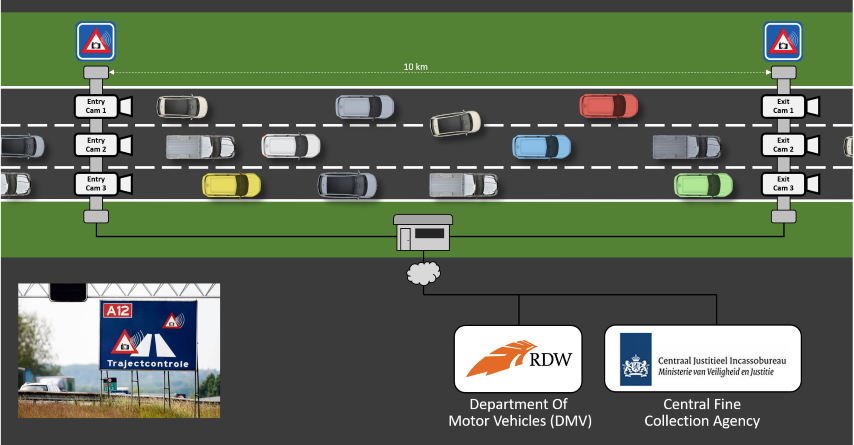
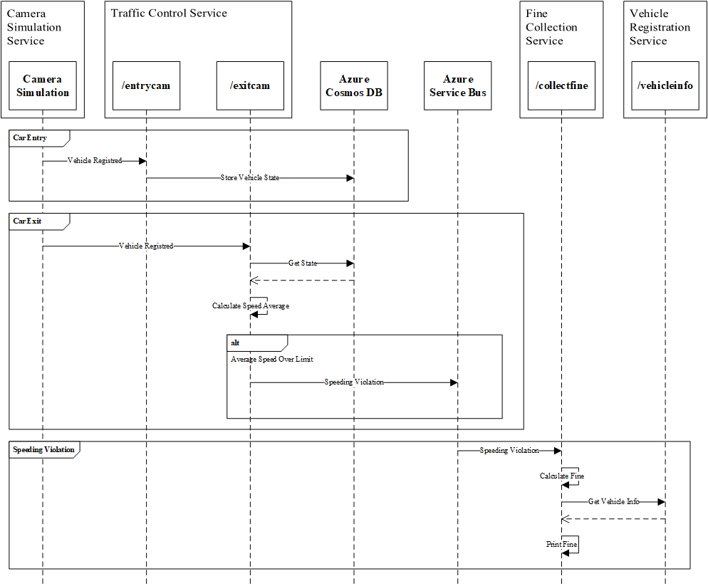

# Sample App: Fine Collection Service

Fine Collection Service is a Java microservice application that simulates a speeding camera setup as can be found on several Dutch highways.

There's 1 entry-camera and 1 exit-camera per lane. When a car passes an entry-camera, the license-number of the car and the timestamp is registered.

When the car passes an exit-camera, this timestamp is also registered by the system. The system then calculates the average speed of the car based on the entry- and exit-timestamp. If a speeding violation is detected, a message is sent to the Central Fine Collection Agency (or CJIB in Dutch). They will retrieve the information of the owner of the vehicle and send him or her a fine.

The sample app is available [here](https://github.com/Azure/java-aks-aca-dapr-workshop). The branch use for this scenario is [e2e-flow](https://github.com/Azure/java-aks-aca-dapr-workshop/tree/e2e-flow).

## Overview

The Fine Collection Service sample app consists of three microservices:

* `vehicle-registration-service`
* `fine-collection-service`
* `traffic-control-service`

Interraction/communication between these microservices is described below: 

1. The **Camera Simulation** generates a random license-number and sends a *VehicleRegistered* message (containing this license-number, a random entry-lane (1-3) and the timestamp) to the `/entrycam` endpoint of the Traffic Control Service.
2. The **Traffic Control Service** stores the *VehicleState* (license-number and entry-timestamp) in Azure Cosmos DB.
3. After some random interval, the Camera Simulation sends a *VehicleRegistered* message to the `/exitcam` endpoint of the Traffic Control Service (containing the license-number generated in step 1, a random exit-lane (1-3) and the exit timestamp).
4. The Traffic Control Service retrieves the *VehicleState* that was stored in Azure Cosmos DB at vehicle entry.
5. The Traffic Control Service calculates the average speed of the vehicle using the entry- and exit-timestamp. It also stores the *VehicleState* in Azure Cosmos DB with the exit timestamp for audit purposes.
6. If the average speed is above the speed-limit, the Traffic Control Service publishes *SpeedingViolation* payload to Azure Service Bus topic *test*. 
7. The **Fine Collection Service** subscribes to Azure Service Bus topic *test*.
8. The Fine Collection Service calculates the fine for the speeding-violation.
9. The Fine Collection Service calls the `/vehicleinfo/{license-number}` endpoint of the Vehicle Registration Service with the license-number of the speeding vehicle to retrieve its vehicle- and owner-information. It uses Dapr service-to-service invocation to call the Vehicle Registration Service.
10. The **Vehicle Registration Service** offers 1 REST endpoint: `/getvehicleinfo/{license-number}` for getting the vehicle- and owner-information of a vehicle.

:arrow_forward: [More information on the architecture of the sample app](./docs/00-fine-collection-architecture.md)

## Deployment

The deployment of the sample app is done in 2 steps:

1. :arrow_forward: [Deploy the landing zone](./docs/01-landing-zone.md)
2. :arrow_forward: [Deploy the container apps, their dependencies and the camera simulation](./docs/02-container-apps.md)
