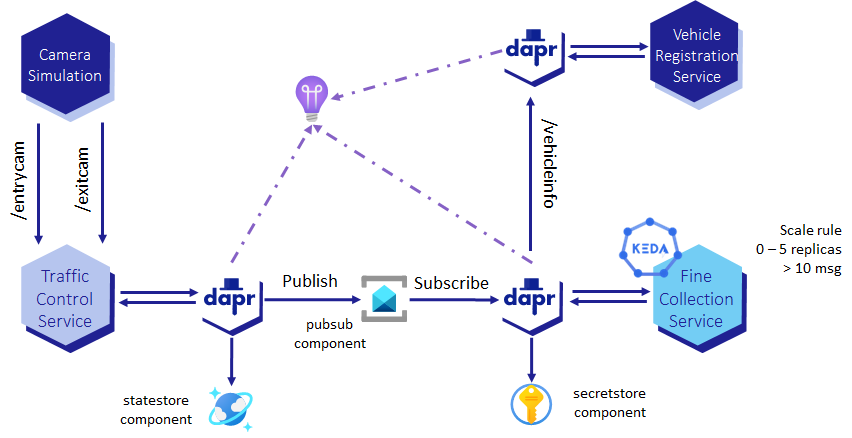

# Fine Collection Service Architecture

For the simulation of Fine Collection Service, 3 microservices are defined:

* `vehicle-registration-service`
* `fine-collection-service`
* `traffic-control-service`



Each microservice corresponds to a container app, as shown on the diagram below.


## Supporting Services

Supporting services used for the container apps are the following:
* Azure Container Registry: used to store the image of the container apps;
* Azure Key Vault: used by Fine Collection Service to get the license key of the fine calculation engine using Dapr secret store `secretstore`;
* Azure Service Bus: used for communication between Traffic Control Service (i.e. the publisher) and Fine Collection Service (i.e. the subscriber);
* Azure Cosmos DB: used by Traffic Control Service to store the state of vehicle and compute the speed violation.

Both Azure Container Registry and Azure Key Vault are deployed by the landing zone accelerator in the spoke resource group. Azure Service Bus and Azure Cosmos DB are deployed in the spoke resource group by the sample app Bicep template. They are created with a private endpoint and private DNS. Public network access is disabled for both resources.

## Dapr Components

There are 3 Darp components for Fine Collection Service sample app:

* `secretstore`: corresponds to [Dapr Secret Management building block](https://docs.dapr.io/developing-applications/building-blocks/secrets/). It is used by Fine Collection Service to retrieve the license key secret for the fine calculation engine.
* `pubsub`: corresponds to [Dapr Publish and Subscribe building block](https://docs.dapr.io/developing-applications/building-blocks/pubsub/pubsub-overview/). It used by:
  * Traffic Control Service to publish a *SpeedingViolation* payload when the average speed is above the speed-limit;
  * Fine Collection Service to subscribe to the topic *test* to consume speeding violation and computing corresponding fine. The subscription for the topic is created in bicep template [service-bus.bicep](../modules/service-bus.bicep) and the subscription name is the same as the Dapr `App Id` of fine collection service container apps. To disable the management of the subscription by Dapr, `disableEntityManagement` metadata field is set to `true`.
* `statestore`: corresponds to [Dapr State Management building block](https://docs.dapr.io/developing-applications/building-blocks/state-management/state-management-overview/). It is used by Traffic Control Service to store and retrieve the state of a vehicle when one of its public endpoints is called.

## Service-to-Service invocation

Fine Collection Service received the license plate number when there is a speed violation. To get the information of the owner of the vehicle it calls Vehicle Registration Service using [Dapr Service Invocation building block](https://docs.dapr.io/developing-applications/building-blocks/service-invocation/service-invocation-overview/). Service discovery is used by Dapr side car of Fine Collection Service to find Vehicle Registration Service.

In the bicep template, the name of Vehicle Registration Service is passed to Fine Collection as an environment variable `VEHICLE_REGISTRATION_SERVICE`:

``` bicep
template: {
  containers: [
    {
      name: fineCollectionServiceName
      image: fineCollectionServiceImage
      resources: {
        cpu: json('0.5')
        memory: '1.0Gi'
      }
      env: [
        {
          name: 'VEHICLE_REGISTRATION_SERVICE'
          value: vehicleRegistrationServiceName
        }
      ]
    }
  ]
```

The value of this environment variable is the Dapr `App Id` of Vehicle Registration Service container app. The container apps are created with the following name: `ca-<service-name>` where the service name is also Dapr `App Id`. For example, the Dapr `App Id` of Vehicle Registration Service is `vehicle-registration-service` and the container app name is `ca-vehicle-registration-service`.

## Container Apps Scale Rule

If there is no message on Azure Service Bus topic *test*, Container Apps will scale down the number of replica of Fine Collection Service to 0. When a message is published on the topic, Container Apps will scale up the number of pods of Fine Collection Service.

The scale rule defines the minimum number of replica to 0 and the maximum number of replica to 6. It is defined in the file [fine-collection-service.bicep](../modules/container-apps/fine-collection-service.bicep):

``` bicep
scale: {
  minReplicas: 0
  maxReplicas: 5
  rules: [
    {
      name: 'service-bus-test-topic'
      custom: {
        type: 'azure-servicebus'
        auth: [
          {
            secretRef: 'service-bus-connection-string'
            triggerParameter: 'connection'
          }
        ]
        metadata: {
          subscriptionName: fineCollectionServiceName
          topicName: serviceBusTopicName
          messageCount: '10'
        }
      }
    }
  ]
}
```

`messageCount` is the number of messages in the topic that triggers the scaling up of the number of replica. If there is more than 10 messages in the topic, KEDA will scale up the number of replica. The scaler used for the scale rule is [KEDA Azure Service Bus scaler](https://keda.sh/docs/2.9/scalers/azure-service-bus/).

### Scale Rule with Secret Reference

 Container Apps scale rules only support secret reference. The secret reference is defined in the file [container-apps.bicep](../modules/container-apps.bicep)

``` bicep
secrets: [
  {
    name: 'service-bus-connection-string'
    value: serviceBusTopicAuthorizationRule.listKeys().primaryConnectionString
  }
]
```

When service bus topic is created, an authorization rule is created with the name `TestTopicSharedAccessKey`. The secret reference is the primary connection string of this authorization rule. The only right that is granted to this authorization rule is `Listen` on the *test* topic.

## Managed identities

For this sample app, it was decided to use system assigned managed identities (SMI) and respect the least privilege principle. This managed identity is created with sample app. The roles are assigned after the creation of the sample app. This can lead the app to fails when it is deployed before the roles are assigned. After the roles are assigned, the app will start correctly.

For example, if you are using Dapr components with SMI, the Dapr side car will fail to start because the SMI does not have the right to access the service when it is first started. After several minutes, the SMI will have roles assigned and the Dapr side car will start correctly.

User assigned managed identities (UMI) can be used for Dapr components. The Dapr side car will start correctly because the UMI has the right to access the service. However, the Dapr components required to be created with `azureClientId` metadata field. This field is the client id of the UMI. The consequence of using UMI instead of SMI is that you'll need to create one Dapr component per UMI to respect the least privilege principle.

For example for a pub/sub component, if you want to have a sender and a receiver, you'll need to create 2 Dapr components. One with the UMI of the sender and the other with the UMI of the receiver. The sender is assigned on topic level and the receiver on the subscription level. When creating your Dapr components, you'll need to choose what fits best your needs.

The managed identities used by the container apps are the following:
* User managed identity `id-cr...` created in [Supporting Services](../../../modules/03-supporting-services/deploy.supporting-services.bicep) is used to pull images from the private container registry.
* Traffic Control Service uses System Assigned Identity to access Azure Service Bus and Azure Cosmos DB. It is assigned in bicep template [traffic-control-service.bicep](../modules/container-apps/traffic-control-service.bicep).
  * Traffic Control Service system assigned identity is granted the built-in role `Azure Service Bus Data Sender` on the service bus topic.
  * Traffic Control Service system assigned identity is granted the built-in role `DocumentDB Data Contributor` on the Cosmos DB container.
* Fine Collection Service uses System Assigned Identity to access Azure Service Bus and Azure Key Vault.
  * Fine Collection Service system assigned identity is granted the built-in role `Azure Service Bus Data Receiver` on the service bus topic. It is assigned in bicep template [fine-collection-service.bicep](../modules/container-apps/fine-collection-service.bicep).
  * Fine Collection Service system assigned identity is granted the built-in role `Key Vault Secrets User` on the Key Vault secret `license-key`. It is assigned in bicep template [fine-license-key](../modules/container-apps/secrets/fine-license-key.bicep).

Guidelines on managed identities can be found [here](../../../../../../docs/design-areas/identity.md).
  
## Exposing Traffic Control Service endpoints

Traffic Control Service endpoints are exposed using Azure Application Gateway. The endpoints are exposed using the FQDN set with parameters `applicationGatewayFqdn`.

The landing zone provides a self-signed certificate for the FQDN `acahello.demoapp.com`. The certificate is used to secure the endpoints exposed by the Application Gateway. The certificate is stored in the key vault in the bicep template [app-gateway-cert.bicep](../../../modules/06-application-gateway/modules/app-gateway-cert.bicep).

> **Important**
> The certificate is self-signed and is not trusted. It is used for demo purposes only. In a production environment and for real workload, you should use a trusted certificate.
>
The primary backend FQDN is set to the traffic control service FQDN. Ingress is enable for traffic control service and its traffic is limited to the VNet:

``` bicep
      ingress: {
        external: true
        targetPort: 6000
        allowInsecure: false
      }
```

When the container app environment is deployed as internal, the external ingress corresponds to the ingress traffic limited to the VNet. When the container app environment is deployed as external, the external ingress corresponds to public ingress traffic.

The application gateway is communicating with the backend pool (i.e. traffic control service) using HTTPS. Therefore, `allowInsecure` is set to `false`. To check that the service is healthy, it is using a health probe. The health probe is configured to use HTTPS and the path `/healthz`. Traffic control service is configured to return a 200 HTTP status code when the path `/healthz` is called.

To know more about networking, see [Networking considerations for Azure Container Apps](../../../../../../docs/design-areas/networking.md).

## Dapr Observability

By setting `daprAIInstrumentationKey` to `true`, Dapr will automatically send telemetry to Application Insights. The screenshot below shows the telemetry sent by Dapr to Application Insights.


## Camera Simulation

Camera simulation simulates traffic camera. It can be deployed in the container apps environment, in another Azure service or on a local machine. It is used to publish *VehicleRegistred* message to `/entrycam` and `/exitcam` endpoints of the Traffic Control Service. More information on how to deploy camera simulation can be found [here](./02-container-apps.md#camera-simulation).

:arrow_forward: [Deploy the landing zone](./01-landing-zone.md)
