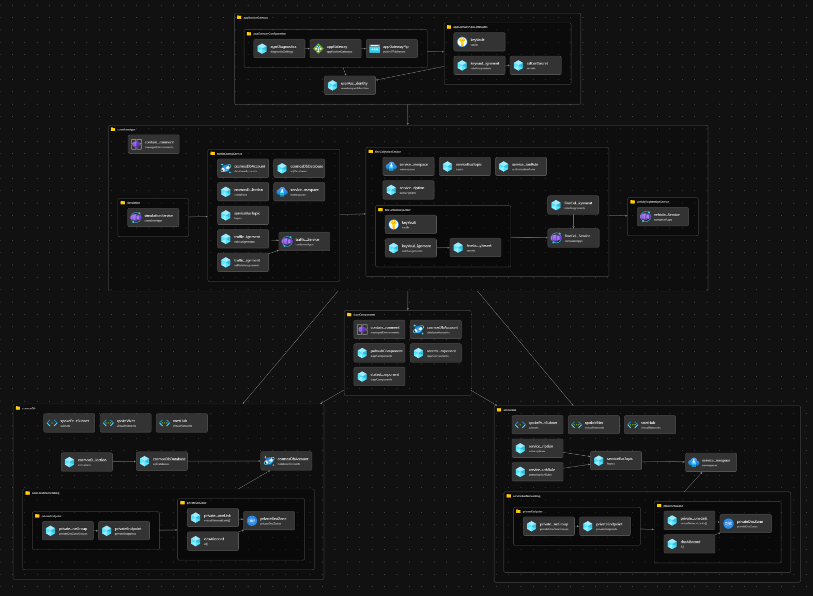

# Deploy the Container Apps

Once the landing zone is deployed, the container apps, their dependencies and the camera simulation can be deployed. 

The 5 building blocks for this sample app are:

* Azure Service Bus: the messaging supporting service used by traffic control service and fine collection service
* Azure Cosmos DB: the state store supporting service used by traffic control service
* The dapr components used by fine collection service and traffic control service:
  * **secretstore**: to access the license key of the fine calculation engine
  * **pubsub**: to publish and subscribe to the topic *test*
  * **statestore**: to store and retrieve the state of a vehicle
- Container apps (i.e. microservices and optionally the camera simulation):
  - fine collection service
  - traffic control service
  - vehicle registration service
  - camera simulation (optional)
- Application Gateway: to expose the traffic control service endpoints to the internet



There are multiple options provided with this guide to deploy the container images and the camera simulation.

This guide is divided in 4 sections:

1. [Build the container images](#build-the-container-images)
2. [Deploy the sample app](#deploy-the-sample-app)
3. [Camera simulation](#camera-simulation)
4. [Test the sample app](#test-the-sample-app)


## Build the container images

There are 3 options to build the container images:

1. Build the container images in the jump box VM and push them to your private Azure Container Registry
2. Import pre-built public images to your private Azure Container Registry
3. Use the pre-built public images from Azure Container Registry

For the two first options, you need the name of the container registry. You can get this name from the landing zone deployment:

```bash
LZA_DEPLOYMENT_NAME=<LZA_DEPLOYMENT_NAME>
CONTAINER_REGISTRY_NAME=$(az deployment sub show -n "$LZA_DEPLOYMENT_NAME" --query properties.outputs.containerRegistryName.value -o tsv)
```

Where `LZA_DEPLOYMENT_NAME` is the name of the deployment of the landing zone.

The latest images can be found [here](https://github.com/orgs/Azure/packages?repo_name=java-aks-aca-dapr-workshop)

### Option 1 - Build and push the container images in your private Azure Container Registry

* An example of shell script [jumpbox-setup.sh](../../../../../shared/scripts/jumpbox-setup.sh) can be used to build the container images in the jump box and push it into a private ACR.
* A detailed explanation of how the entire solution and each of the microservices can be built, containerized and deployed can be found in this [workshop](https://azure.github.io/java-aks-aca-dapr-workshop/modules/05-assignment-5-aks-aca/02-aca/1-aca-instructions.html#generate-docker-images-for-applications-and-push-them-to-acr)

When the images are pushed to your private container registry, set the following parameters in the `main.parameters.jsonc` file or set environment variables with the same name:

```bash
TAG=<TAG>
VEHICLE_REGISTRATION_SERVICE_IMAGE=$CONTAINER_REGISTRY_NAME.azurecr.io/vehicle-registration-service:$TAG
FINE_COLLECTION_SERVICE_IMAGE=$CONTAINER_REGISTRY_NAME.azurecr.io/fine-collection-service:$TAG
TRAFFIC_CONTROL_SERVICE_IMAGE=$CONTAINER_REGISTRY_NAME.azurecr.io/traffic-control-service:$TAG
SIMULATION_IMAGE=$CONTAINER_REGISTRY_NAME.azurecr.io/simulation:$TAG
```

Where `TAG` is the tag of the container images. `SIMULATION_IMAGE` is optional and is only needed if you want to deploy the camera simulation as a container app.

:arrow_down: [Deploy the sample app](#deploy-the-sample-app)

### Option 2 - Import pre-built public images to your private Azure Container Registry

All the container image are available in a public image repository. If you do not wish to build the container images from code directly, you can import it directly into your private container instance as shown below. Note - you might need to execute this from a jump box or workstation which can reach your private container registry instance.

```bash
TAG=<TAG>
VEHICLE_REGISTRATION_SERVICE_IMAGE=$CONTAINER_REGISTRY_NAME.azurecr.io/vehicle-registration-service:$TAG
FINE_COLLECTION_SERVICE_IMAGE=$CONTAINER_REGISTRY_NAME.azurecr.io/fine-collection-service:$TAG
TRAFFIC_CONTROL_SERVICE_IMAGE=$CONTAINER_REGISTRY_NAME.azurecr.io/traffic-control-service:$TAG
SIMULATION_IMAGE=$CONTAINER_REGISTRY_NAME.azurecr.io/simulation:$TAG

az login

az acr login -n $CONTAINER_REGISTRY_NAME

az acr import \
  --name $CONTAINER_REGISTRY_NAME \
  --image vehicle-registration-service:$TAG \
  --source ghcr.io/azure/vehicle-registration-service:a4fc4d9

az acr import \
  --name $CONTAINER_REGISTRY_NAME \
  --image fine-collection-service:$TAG \
  --source ghcr.io/azure/fine-collection-service:a4fc4d9

az acr import \
  --name $CONTAINER_REGISTRY_NAME \
  --image traffic-control-service:$TAG \
  --source ghcr.io/azure/traffic-control-service:506de24

az acr import \
  --name $CONTAINER_REGISTRY_NAME \
  --image simulation:$TAG \
  --source ghcr.io/azure/simulation:a4fc4d9
```

Where `TAG` is the tag of the container images. `SIMULATION_IMAGE` is optional and is only needed if you want to deploy the camera simulation as a container app.

Like for option 1, you can set the Bicep parameters for the image in the `main.parameters.jsonc` or use the environment variables defined above.

> **NOTE**
>
> To be able to import the images from the public repository, you need to be logged in to the private container registry. To do so you'll need to install docker in the jump box VM or workstation. The script [jumpbox-setup.sh](../../../../../shared/scripts/jumpbox-setup.sh) can be used as an example on how to install docker.
>

:arrow_down: [Deploy the sample app](#deploy-the-sample-app)

### Option 3 - Use the public container images and deploy them directly in Azure Container Apps

The public images can be set directly in the `main.parameters.jsonc` file:

```json
"vehicleRegistrationServiceImage": {
  "value": "ghcr.io/azure/vehicle-registration-service:a4fc4d9"
},
"fineCollectionServiceImage": {
  "value": "ghcr.io/azure/fine-collection-service:a4fc4d9"
},
"trafficControlServiceImage": {
  "value": "ghcr.io/azure/traffic-control-service:506de24"
},

...

"simulationImage": {
  "value": "ghcr.io/azure/simulation:a4fc4d9"
}
```

or in the environment variables:

```bash
VEHICLE_REGISTRATION_SERVICE_IMAGE=ghcr.io/azure/vehicle-registration-service:a4fc4d9
FINE_COLLECTION_SERVICE_IMAGE=ghcr.io/azure/fine-collection-service:a4fc4d9
TRAFFIC_CONTROL_SERVICE_IMAGE=ghcr.io/azure/traffic-control-service:506de24
SIMULATION_IMAGE=ghcr.io/azure/simulation:a4fc4d9
```

The simulation image is optional and is only needed if you want to deploy the camera simulation as a container app.

## Deploy the sample app

The sample app can be deployed using the [main.bicep](../bicep/main.bicep) template. It will deployed all the building blocks described above.

To set the parameters for the deployment, you can either use the `main.parameters.jsonc` file or set environment variables.

// TODO add table of parameters

### Deploy the sample app using the `main.parameters.jsonc` file

For the [camera simulation](#camera-simulation) you can choose to deploy it in a container app, to use a REST client template or to run it as a standalone application. If you choose to run the camera simulation as a container apps in the deployed environment, you need to set the bicep parameter `deployCameraSimulation` to `true`, otherwise set it to `false`.

To deploy the sample app using the `main.parameters.jsonc` file, run the following command in the `bicep` folder:

```bash
az deployment group create \
  -g <SPOKE_RESOURCE_GROUP_NAME> \
  --name <DEPLOYMENT_NAME> \
  -f main.bicep \
  -p main.parameters.jsonc
```

Where `<SPOKE_RESOURCE_GROUP_NAME>` is the name of the spoke resource group where the sample app will be deployed and `<DEPLOYMENT_NAME>` is the name of the sample app deployment.

:arrow_down: [Camera Simulation](#camera-simulation)

### Deploy the sample app using environment variables

You can override the parameters in the `main.parameters.jsonc` when creating the deployment using:

```bash
  --parameters <parameter-name>=<parameter-value>
```

Where `<parameter-name>` is the name of the parameter and `<parameter-value>` is the value of the parameter.

You can get the parameters from the landing zone deployment:

```bash
LZA_DEPLOYMENT_NAME=<LZA_DEPLOYMENT_NAME>
SPOKE_RESOURCE_GROUP_NAME=$(az deployment sub show -n "$LZA_DEPLOYMENT_NAME" --query properties.outputs.spokeResourceGroupName.value -o tsv)
CONTAINER_APPS_ENVIRONMENT_NAME=$(az deployment sub show -n "$LZA_DEPLOYMENT_NAME" --query properties.outputs.containerAppsEnvironmentName.value -o tsv)
HUB_VNET_ID=$(az deployment sub show -n "$LZA_DEPLOYMENT_NAME" --query properties.outputs.hubVNetId.value -o tsv)
SPOKE_VNET_NAME=$(az deployment sub show -n "$LZA_DEPLOYMENT_NAME" --query properties.outputs.spokeVnetName.value -o tsv)
SPOKE_PRIVATE_ENDPOINTS_SUBNET_NAME=$(az deployment sub show -n "$LZA_DEPLOYMENT_NAME" --query properties.outputs.spokePrivateEndpointsSubnetName.value -o tsv)
KEY_VAULT_ID=$(az deployment sub show -n "$LZA_DEPLOYMENT_NAME" --query properties.outputs.keyVaultId.value -o tsv)
CONTAINER_REGISTRY_NAME=$(az deployment sub show -n "$LZA_DEPLOYMENT_NAME" --query properties.outputs.containerRegistryName.value -o tsv)
CONTAINER_REGISTRY_USER_ASSIGNED_IDENTITY_ID=$(az deployment sub show -n "$LZA_DEPLOYMENT_NAME" --query properties.outputs.containerRegistryUserAssignedIdentityId.value -o tsv)
SPOKE_APPLICATION_GATEWAY_SUBNET_NAME=$(az deployment sub show -n "$LZA_DEPLOYMENT_NAME" --query properties.outputs.spokeApplicationGatewaySubnetName.value -o tsv)
DEPLOY_CAMERA_SIMULATION=<true|false>
```

Where `<LZA_DEPLOYMENT_NAME>` is the name of the landing zone deployment and `DEPLOY_CAMERA_SIMULATION` is a boolean value that indicates if the camera simulation should be deployed as a container app. Its value can be `true` or `false`.

To deploy the sample app using environment variables, run the following command in the `bicep` folder:

```bash
LZA_DEPLOYMENT_SAMPLE_JAVA=bicepLzaDeploymentSampleJava  # or any other value that suits your needs

az deployment group create -g "$SPOKE_RESOURCE_GROUP_NAME" -f main.bicep -p main.parameters.jsonc \
  --name $LZA_DEPLOYMENT_SAMPLE_JAVA \
  --parameters containerAppsEnvironmentName=$CONTAINER_APPS_ENVIRONMENT_NAME \
  --parameters hubVNetId=$HUB_VNET_ID \
  --parameters spokeVNetName=$SPOKE_VNET_NAME \
  --parameters spokePrivateEndpointsSubnetName=$SPOKE_PRIVATE_ENDPOINTS_SUBNET_NAME \
  --parameters keyVaultId=$KEY_VAULT_ID \
  --parameters containerRegistryName=$CONTAINER_REGISTRY_NAME \
  --parameters vehicleRegistrationServiceImage=$VEHICLE_REGISTRATION_SERVICE_IMAGE \
  --parameters fineCollectionServiceImage=$FINE_COLLECTION_SERVICE_IMAGE \
  --parameters trafficControlServiceImage=$TRAFFIC_CONTROL_SERVICE_IMAGE \
  --parameters containerRegistryUserAssignedIdentityId=$CONTAINER_REGISTRY_USER_ASSIGNED_IDENTITY_ID \
  --parameters deploySimulationInAcaEnvironment=$DEPLOY_CAMERA_SIMULATION \
  --parameters simulationImage=$SIMULATION_IMAGE \
  --parameters spokeApplicationGatewaySubnetName=$SPOKE_APPLICATION_GATEWAY_SUBNET_NAME
```

Where `<DEPLOYMENT_NAME>` is the name of the sample app deployment.

## Camera Simulation

There are 3 ways to run the camera simulation service:

1. Run the camera simulation in a container app
2. Use a REST client template to send requests to the traffic control service
3. Run the camera simulation service from your development machine or the jump box VM

### Option 1: Run the camera simulation in a container app

To run the camera simulation in a container app, you need to set the bicep parameter `deployCameraSimulation` to `true` when deploying the sample app. The camera simulation service will be deployed as a container app in the environment. If it was set to `false`, you can still run the camera simulation in the environment by updating its value to `true` and [redeploying the sample app](#deploy-the-sample-app). Only the modification will be applied.

When deploying with the Bicep templates, the environment variable [`TRAFFIC_CONTROL_SERVICE_BASE_URL`](https://github.com/Azure/java-aks-aca-dapr-workshop/blob/e2e-flow/Simulation/src/main/resources/application.yml#L25) is set to the FQDN of the traffic control service. It is passed in the [container-apps.bicep](../modules/container-apps.bicep) file to the simulation container app template: [simulation.bicep](../modules/container-apps/simulation.bicep).

:arrow_down: [Test the sample app](#test-the-sample-app)

### Option 2: Use a REST client template to send requests to the traffic control service

In VS Code, you can use the following REST client template to send requests to the traffic control service:

```http
@host = <APPLICATION_GATEWAY_PUBLIC_IP>

// Register entry
POST https://{{host}}/entrycam
Content-Type: application/json

{ "lane": 1, "licenseNumber": "AB-123-C", "timestamp": "2023-04-02T19:48:00" }

###

// Register exit (without violation)
POST https://{{host}}/exitcam
Content-Type: application/json

{ "lane": 1, "licenseNumber": "AB-123-C", "timestamp": "2023-04-02T19:48:06" }

###

// Register exit (with violation)
POST https://{{host}}/exitcam
Content-Type: application/json

{ "lane": 1, "licenseNumber": "AB-123-C", "timestamp": "2023-04-02T19:48:05" }
```

Where `<APPLICATION_GATEWAY_PUBLIC_IP>` is the public IP of the application gateway and can be get from sample app deployment outputs using:

```bash
az deployment group show -g "$SPOKE_RESOURCE_GROUP_NAME" -n "<DEPLOYMENT_NAME>" --query properties.outputs.applicationGatewayPublicIp.value -o tsv
```

Where `<DEPLOYMENT_NAME>` is the name of the sample app deployment.

:arrow_down: [Test the sample app](#test-the-sample-app)

### Option 3: Run the camera simulation service from your development machine or the jump box VM

If you want to run the camera simulation service from your development machine or the jump box VM, you need to set the environment variable `TRAFFIC_CONTROL_SERVICE_BASE_URL` to the FQDN of the application gateway. You can get the FQDN of the application gateway from the sample app deployment outputs using:

```bash
export TRAFFIC_CONTROL_SERVICE_BASE_URL=https://$(az deployment group show -g "$SPOKE_RESOURCE_GROUP_NAME" -n "<DEPLOYMENT_NAME>" --query properties.outputs.applicationGatewayFqdn.value -o tsv)
```

Where `<DEPLOYMENT_NAME>` is the name of the sample app deployment.

**Trusted Certificate**

If you use a trusted certificate you, you can directly run the simulation by first building the application and then running it:

```bash
cd Simulation
mvn clean package
mvn spring-boot:run
```

For more information on how to run the simulation service, see the [Deploy to ACA with Dapr](https://azure.github.io/java-aks-aca-dapr-workshop/modules/05-assignment-5-aks-aca/02-aca/1-aca-instructions.html).

:arrow_down: [Test the sample app](#test-the-sample-app)

**Self-signed Certificate**

If you use a self-signed certificate like the one provided in the landing zone, you have two options:

1. Add the certificate to the Java keystore
2. Update Simulation REST template to disable certificate validation

You also need to add the FQDN of the application gateway to the `hosts` file of your development machine or the jump box VM. For example on Windows, you can add the following line to the `C:\Windows\System32\drivers\etc\hosts` file and on Linux, you can add the following line to the `/etc/hosts` file:

```
<APPLICATION_GATEWAY_PUBLIC_IP> <APPLICATION_GATEWAY_FQDN>
```

Where `<APPLICATION_GATEWAY_PUBLIC_IP>` is the public IP of the application gateway and `<APPLICATION_GATEWAY_FQDN>` is the FQDN of the application gateway:

```bash
az deployment group show -g "$SPOKE_RESOURCE_GROUP_NAME" -n "<DEPLOYMENT_NAME>" --query properties.outputs.applicationGatewayFqdn.value -o tsv

az deployment group show -g "$SPOKE_RESOURCE_GROUP_NAME" -n "<DEPLOYMENT_NAME>" --query properties.outputs.applicationGatewayPublicIp.value -o tsv
```

Where `<DEPLOYMENT_NAME>` is the name of the sample app deployment.

For the second option, you need first to add the following dependency in the `pom.xml` file of the `Simulation` application:

```xml
<dependency>
  <groupId>org.apache.httpcomponents</groupId>
  <artifactId>httpclient</artifactId>
</dependency>
```

Then, you need to update `SimulationConfiguration.java` to return a `RestTemplate` bean that disables certificate validation:

```java
@Bean
public RestTemplate restTemplate() throws NoSuchAlgorithmException, KeyManagementException, KeyStoreException {
    RestTemplate restTemplate = new RestTemplate();
    restTemplate.setRequestFactory(new HttpComponentsClientHttpRequestFactory(
        HttpClientBuilder
                .create()
                .setSSLContext(SSLContexts.custom().loadTrustMaterial(null, (x509Certificates, s) -> true).build())
                .build()));
    return restTemplate;
}
```

> **IMPORTANT**
>
> This is only for testing purpose. Disabling certificate validation should be avoided for real workload and for production.
>

You can then run the simulation service using:

```bash
cd Simulation
mvn clean package
mvn spring-boot:run
```

For more information on how to run the simulation service, see the [Deploy to ACA with Dapr](https://azure.github.io/java-aks-aca-dapr-workshop/modules/05-assignment-5-aks-aca/02-aca/1-aca-instructions.html).

## Test the sample app

The logs can be viewed in the portal using `Log Stream` or in the console using the following commands:

First you need the name of the container apps:

```bash
SPOKE_RESOURCE_GROUP_NAME=$(az deployment sub show -n "$LZA_DEPLOYMENT_NAME" --query properties.outputs.spokeResourceGroupName.value -o tsv)

VEHICLE_REGISTRATION_SERVICE_CA_NAME=$(az deployment group show -g $SPOKE_RESOURCE_GROUP_NAME -n $LZA_DEPLOYMENT_SAMPLE_JAVA --query properties.outputs.vehicleRegistrationServiceContainerAppName.value -o tsv)

FINE_COLLECTION_SERVICE_CA_NAME=$(az deployment group show -g $SPOKE_RESOURCE_GROUP_NAME -n $LZA_DEPLOYMENT_SAMPLE_JAVA --query properties.outputs.fineCollectionServiceContainerAppName.value -o tsv)

TRAFFIC_CONTROL_SERVICE_CA_NAME=$(az deployment group show -g $SPOKE_RESOURCE_GROUP_NAME -n $LZA_DEPLOYMENT_SAMPLE_JAVA --query properties.outputs.trafficControlServiceContainerAppName.value -o tsv)
```

Where `$LZA_DEPLOYMENT_SAMPLE_JAVA ` is the name of the sample app deployment.

You also need the log analytics workspace customer id:

```bash
LOG_ANALYTICS_WORKSPACE_CUSTOMER_ID=$(az deployment sub show -n "$LZA_DEPLOYMENT_NAME" --query properties.outputs.logAnalyticsWorkspaceCustomerId.value -o tsv)
```

For traffic control service:

```bash
TRAFFIC_CONTROL_SERVICE_REVISION=$(az containerapp revision list -n "$TRAFFIC_CONTROL_SERVICE_CA_NAME" -g $SPOKE_RESOURCE_GROUP_NAME --query "[0].name" -o tsv)
```

```bash
az monitor log-analytics query \
  --workspace $LOG_ANALYTICS_WORKSPACE_CUSTOMER_ID \
  --analytics-query "ContainerAppConsoleLogs_CL | where RevisionName_s == '$TRAFFIC_CONTROL_SERVICE_REVISION' | project TimeGenerated, Log_s | order by TimeGenerated | take 5" \
  --out table
```

For fine collection service:

```bash
FINE_COLLECTION_SERVICE_REVISION=$(az containerapp revision list -n "$FINE_COLLECTION_SERVICE_CA_NAME" -g $SPOKE_RESOURCE_GROUP_NAME --query "[0].name" -o tsv)
```

```bash
az monitor log-analytics query \
  --workspace $LOG_ANALYTICS_WORKSPACE_CUSTOMER_ID \
  --analytics-query "ContainerAppConsoleLogs_CL | where RevisionName_s == '$FINE_COLLECTION_SERVICE_REVISION' | project TimeGenerated, Log_s | order by TimeGenerated | take 5" \
  --out table
```

For vehicle registration service:

```bash
VEHICLE_REGISTRATION_SERVICE_REVISION=$(az containerapp revision list -n "$VEHICLE_REGISTRATION_SERVICE_CA_NAME" -g $SPOKE_RESOURCE_GROUP_NAME --query [0].name -o tsv)
```

```bash
az monitor log-analytics query \
  --workspace $LOG_ANALYTICS_WORKSPACE_CUSTOMER_ID \
  --analytics-query "ContainerAppConsoleLogs_CL | where RevisionName_s == '$VEHICLE_REGISTRATION_SERVICE_REVISION' | project TimeGenerated, Log_s | order by TimeGenerated | take 5" \
  --out table
```
