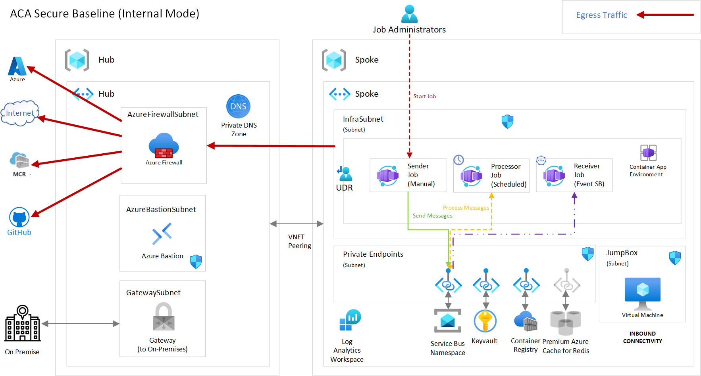
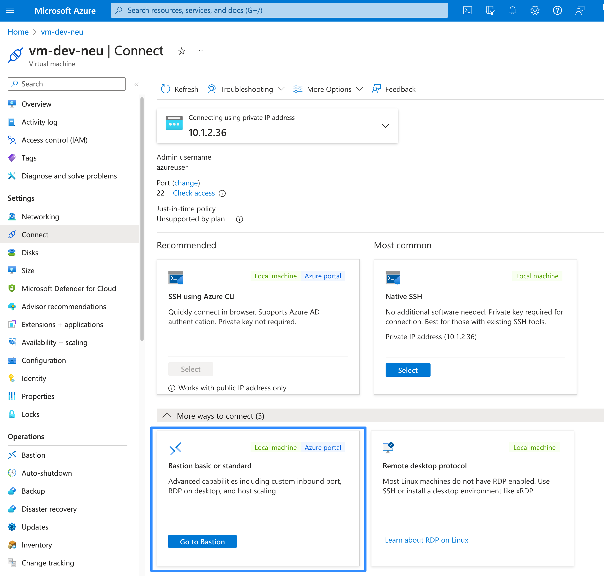
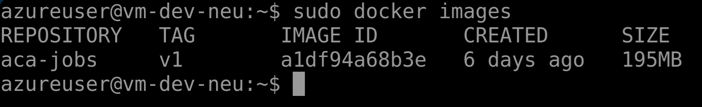
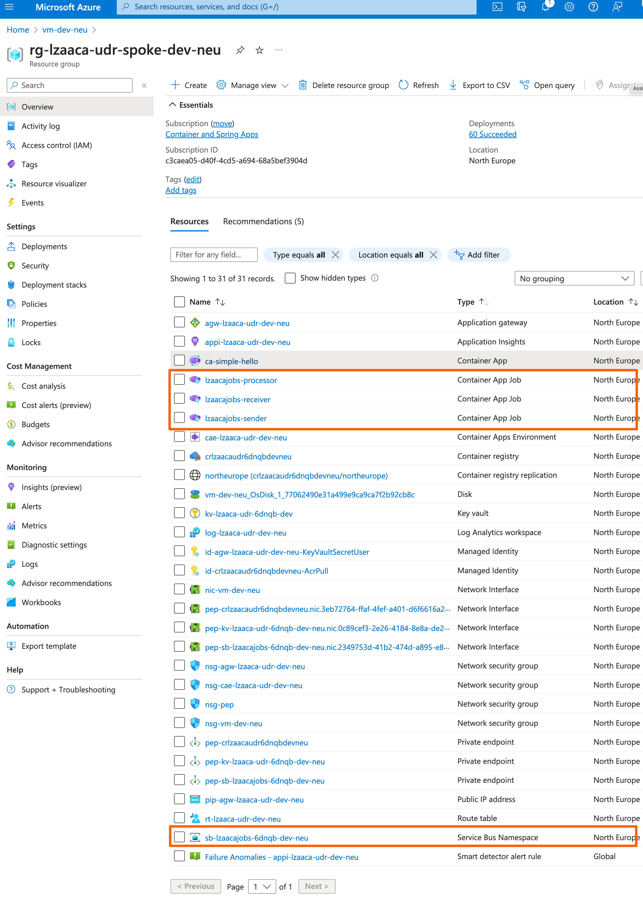
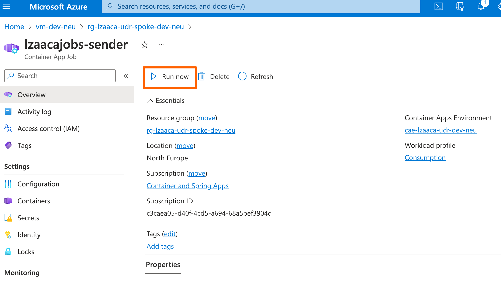
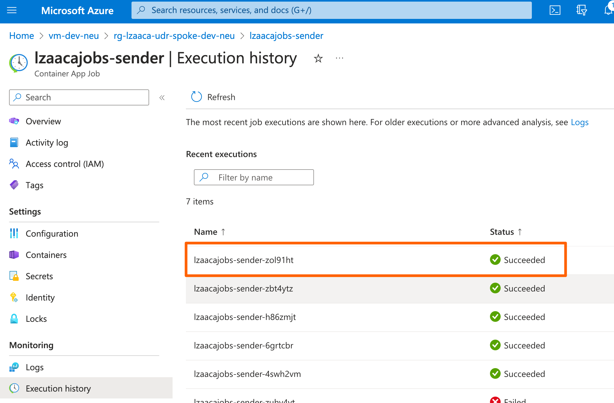
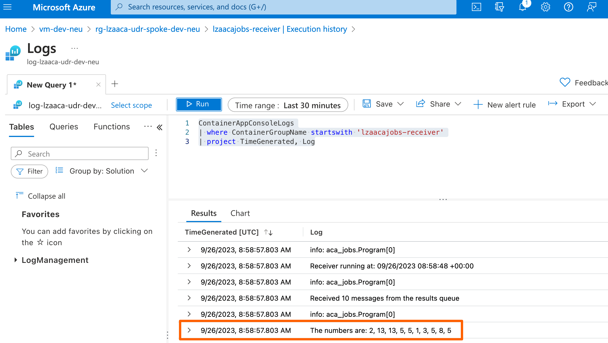

# Azure Container Apps Jobs
Azure Container Apps Jobs allow you to run containerized tasks that execute for a given duration and complete. You can use jobs to run tasks such as data processing, machine learning, or any scenario where on-demand processing is required. For more information, see the following tutorials:

- [Create a job with Azure Container Apps](https://learn.microsoft.com/en-us/azure/container-apps/jobs-get-started-cli?pivots=container-apps-job-manual): In this tutorial, you create a manual or scheduled job.
- [Deploy an event-driven job with Azure Container Apps](https://learn.microsoft.com/en-us/azure/container-apps/tutorial-event-driven-jobs): shows how to create a job whose execution is triggered by each message that is sent to an Azure Storage Queue.
- [Deploy self-hosted CI/CD runners and agents with Azure Container Apps jobs](https://learn.microsoft.com/en-us/azure/container-apps/tutorial-ci-cd-runners-jobs?tabs=bash&pivots=container-apps-jobs-self-hosted-ci-cd-github-actions) shows how to run a [GitHub Actions self-hosted runner](https://docs.github.com/en/actions/hosting-your-own-runners/managing-self-hosted-runners/about-self-hosted-runners) as an event-driven Azure Container Apps Job.

## Job trigger types
A job's trigger type determines how the job is started. The following trigger types are available:

### Manual jobs
Manual jobs are triggered on-demand using the Azure CLI, through the Azure portal or a request to the Azure Resource Manager API.

Examples of manual jobs include:
One-time processing tasks such as migrating data from one system to another.
An e-commerce site running as a container app starts a job execution to process inventory when an order is placed.

### Scheduled Jobs
Scheduled jobs are triggered at specific times and can run repeatedly. Azure Container Apps Jobs use Cron expressions to define schedules. They support the standard cron expression format with five fields for minute, hour, day of month, month, and day of week. Cron expressions in scheduled jobs are evaluated in Universal Time Coordinated (UTC).  The following are examples of cron expressions:

| Expression | Description |
|------------|-------------|
| ```0 */2 * * *```| Runs every two hours |
| ```0 0 * * *```  | Runs every day at midnight. |
| ```0 0 * * 0```  | Runs every Sunday at midnight. |
| ```0 0 1 * *```  | Runs on the first day of every month at midnight. |

### Event driven jobs 
Event-driven jobs
Event-driven jobs are triggered by events from supported custom scalers. Examples of event-driven jobs include: 
- A job that runs when a new message is added to a queue, such as Azure Service Bus, Azure Event Hubs, Apache Kafka, or RabbitMQ.
- A self-hosted GitHub Actions runner or Azure DevOps agent that runs when a new job is queued in a workflow or pipeline.
 
Container apps and event-driven jobs use KEDA scalers. They both evaluate scaling rules on a polling interval to measure the volume of events for an event source, but the way they use the results is different.

In an app, each replica continuously processes events and a scaling rule determines the number of replicas to run to meet demand. In event-driven jobs, each job typically processes a single event, and a scaling rule determines the number of jobs to run.

## Jobs Sample Container App
The purpose of this sample app is to demonstrate the usage of the [Jobs feature](https://learn.microsoft.com/en-us/azure/container-apps/jobs?tabs=azure-cli) within the context of the Azure Container Apps landing zone accelerator. The solution deploys all 3 different [types](https://learn.microsoft.com/en-us/azure/container-apps/jobs?tabs=azure-cli#job-trigger-types) of Jobs, a manual triggered, a schedule triggered and an event trigered one with basic functionality of calculating the Fibonacci number for a given range of numbers.

## Architecture


### Prerequisites
 - An active Azure Container Apps landing zone deployment
 - [Visual Studio Code](https://code.visualstudio.com/) installed on one of the supported platforms along with the [Bicep extension](https://marketplace.visualstudio.com/items?itemName=ms-azuretools.vscode-bicep).
 - Azure CLI version 2.49.0 or later installed. To install or upgrade, see [Install Azure CLI](https://learn.microsoft.com/en-us/cli/azure/install-azure-cli).

### Jobs source code implementation
The Jobs used are implemented as a single dotnet console application which can be found under the src directory of the sample application. 
The behavior of the dotnet console application is controlled at runtime through the ```WORKEROLE``` application setting. So you can run a:

- Sender job: 
  
  by setting the ```WORKEROLE``` to the value ```sender``` this implementation sends a configurable amount of messages to the input queue in the Azure Service Bus namespace. The payload of each message contains a random positive integer number comprised in a configurable range.
- Processor job: 
  
  by setting the ```WORKEROLE``` to the value ```processor``` this implementation reads the messages from the input queue in the Azure Service Bus namespace, calculates the [Fibonacci number](https://en.wikipedia.org/wiki/Fibonacci_sequence) for the actual parameter, and writes the result in the output queue in the same namespace.
- Receiver job: 
  
  by setting the ```WORKEROLE``` to the value ```receiver``` this implementation reads the result messages from the output queue and logs it at the console.

Below you can find all the available configuration options for the jobs implementation:

**Environment variables**

| Name | Description | Sample value |
|------|-------------|--------------|
|```SETTINGS__SERVICEBUSNAMESPACE```|The service bus namespace fully qualified url| jobstest.servicebus.windows.net,
|```SETTINGS__INPUTQUEUENAME```|The name of the queue the sender job is going to be pushing messages to and the processing job is going to be reading from.| inputqueue,
|```SETTINGS__OUTPUTQUEUENAME```|The name of the queue the processing job is going to be pushing messages to| output-queue,
|```SETTINGS__MINNUMBER```|The minimum number from which to pick from for the Fibonacci calculation| 1,
|```SETTINGS__MAXNUMBER```|The maximum number from which to pick from for the Fibonacci calculation| 10,
|```SETTINGS__MESSAGECOUNT```|The number of selections, calculations, messages the sender is going to be sending fot the processor job to calculate| 20,
|```SETTINGS__FETCHCOUNT```|The number of messages to be fetched in one go| 10,
|```SETTINGS__MAXWAITTIME```|The allowed maximum wait time for messages to be delivered by the queues| 1,
|```SETTINGS__SENDTYPE```|The way messages are being posted to service bus queues| list/batch,
|```SETTINGS__WORKERROLE```|Defines the role of the job| sender/processor/receiver

### Jobs bicep implementation
The sample is deployed to Azure using a bicep template found at the root directory and named ```main.bicep```. This, besides deploying the Service Bus namespace, it deploys:

- The Manual Container Apps Job
  
  To deploy a manual triggered job in bicep you need to define a [manualTriggerConfig](https://learn.microsoft.com/en-us/azure/templates/microsoft.app/jobs?pivots=deployment-language-bicep#jobconfiguration) at the configuration section of the container app and set the ```triggerType``` to 'Manual'.
  ```bicep
  resource job 'Microsoft.App/jobs@2023-04-01-preview' = {
    name: toLower(name)
    location: location
    tags: tags
    properties: {
        configuration: {
            manualTriggerConfig: {
                replicaCompletionCount: replicaCompletionCount
                parallelism: parallelism
            }
            triggerType: 'Manual'
    ...
  ```

- The Scheduled Container Apps Job

  Similarly to the manual triggered job to deploy a scheduled one you need to define a [scheduleTriggerConfig](https://learn.microsoft.com/en-us/azure/templates/microsoft.app/jobs?pivots=deployment-language-bicep#jobconfiguration) at the configuration section of the container app and set the ```triggerType``` to 'Schedule'
    ```bicep
  resource job 'Microsoft.App/jobs@2023-04-01-preview' = {
    name: toLower(name)
    location: location
    tags: tags
    properties: {
        configuration: {
            scheduleTriggerConfig: {
                cronExpression: cronExpression
                replicaCompletionCount: replicaCompletionCount
                parallelism: parallelism
            }
            triggerType: 'Schedule'
    ...
  ```

- The Event triggered Container Apps Job
  
  To deploy an event triggered job in bicep you need to define a [eventTriggerConfig](https://learn.microsoft.com/en-us/azure/templates/microsoft.app/jobs?pivots=deployment-language-bicep#jobconfiguration) at the configuration section of the container app and set the ```triggerType``` to 'Event'.
  ```bicep
  resource job 'Microsoft.App/jobs@2023-04-01-preview' = {
    name: toLower(name)
    location: location
    tags: tags
    properties: {
        configuration: {
            eventTriggerConfig: {
            replicaCompletionCount: replicaCompletionCount
            parallelism: parallelism
            scale: {
                maxExecutions: maxExecutions
                minExecutions: minExecutions
                pollingInterval: pollingInterval
                rules: [
                    {
                        name: 'azure-servicebus-queue-rule'
                        type: 'azure-servicebus'
                        metadata: {
                            messageCount: '5'
                            namespace: namespace.outputs.serviceBusName
                            queueName: resultsServiceBusQueueName
                        }
                        auth: [
                            {
                                secretRef: 'service-bus-connection-string'
                                triggerParameter: 'connection'
                            }
                        ]
                    }                
                ]
            }
            triggerType: 'Event'
    ...
  ```
## Deployment

1. Login to the VM using Bastion
  
    Since the Container Apps Environment is completely internal and the Container registry is not available through the internet, you will need to perform the deployment steps for the container image steps through the VM jumphost at the Spoke virtual network for which the ACR is available.

    

2. Install pre-reqs azure CLI, Docker client
    
    Unfortunatelly the jump host doesn't have the required tools installed. So, you would have to install them.

    - [az cli](https://learn.microsoft.com/en-us/cli/azure/install-azure-cli-linux?pivots=apt)
        ```bash
        curl -sL https://aka.ms/InstallAzureCLIDeb | sudo bash
        ```
    - [docker client](https://docs.docker.com/engine/install/ubuntu/)
        ```bash
        # Add Docker's official GPG key:
        sudo apt-get update
        sudo apt-get install ca-certificates curl gnupg
        sudo install -m 0755 -d /etc/apt/keyrings
        curl -fsSL https://download.docker.com/linux/ubuntu/gpg | sudo gpg --dearmor -o /etc/apt/keyrings/docker.gpg
        sudo chmod a+r /etc/apt/keyrings/docker.gpg

        # Add the repository to Apt sources:
        echo \
        "deb [arch="$(dpkg --print-architecture)" signed-by=/etc/apt/keyrings/docker.gpg] https://download.docker.com/linux/ubuntu \
        "$(. /etc/os-release && echo "$VERSION_CODENAME")" stable" | \
        sudo tee /etc/apt/sources.list.d/docker.list > /dev/null
        sudo apt-get update

        # Install Docker packages latest version
        sudo apt-get install docker-ce docker-ce-cli containerd.io docker-buildx-plugin docker-compose-plugin

        # verify docker Engine installation
        sudo docker run hello-world
        ```
3. git clone repository
    
    Next the source code needs to be downloaded from the git repository.

    ```bash
    git clone https://github.com/Azure/aca-landing-zone-accelerator.git
    ```
    
4. Build the container image

    To build the docker container image, navigate to the ```aca-landing-zone-accelerator/scenarios/aca-internal/bicep/sample-apps/jobs/src/aca-jobs/``` where the ```Dockerfile``` is located and run

    ```bash
    sudo docker build -t aca-jobs:v1 .
    ```

    Once the image is build you should be able to see it by running

    ```bash
    sudo docker images
    ```

    

5. Publish job image to Azure Container Registry

    To publish the newly created image, you need to first tag it with the fully qualified name of the LZA ACR.

    ```bash
    sudo docker tag aca-jobs:v1 <ACR NAME>.azurecr.io/jobs/aca-jobs:v1
    ```

    To push the image to the private container registry, you need to authenticate first:

    ```bash
    # authenticate to your azure tenant
    az login --use-device-code

    # check the active subscription
    az account show

    # [OPTIONAL] switch to the desired Azure Subscription if required
    az account set -s <SUBSCRIPTION_NAME_OR_SUBSCRIPTION_GUID>
    
    # Authenticate to the Private Container Registry (if The login server endpoint suffix '.azurecr.io' is used, it will be automatically omitted.)
    sudo az acr login --name <ACR NAME>
    
    ```
    and then push it

    ```bash
    sudo docker push <ACR NAME>.azurecr.io/jobs/aca-jobs:v1
    ```

    To verify that the image has been successfully published

    ```bash
    az acr repository list -n <ACR NAME>
    az acr repository show -n <ACR NAME> --image jobs/aca-jobs:v1
    ```

5. Deploy jobs to container apps environment

    Once the image exist at the container registry you can publish the application (jobs). To do so navigate one level up to ```aca-landing-zone-accelerator/scenarios/aca-internal/bicep/sample-apps/jobs/``` and run the following az deployment script replacing the parameter values with the required information.

    ```bash 
    # Change directory to the bicep folder (/aca-landing-zone-accelerator/scenarios/aca-internal/bicep/sample-apps/jobs)
    # <MID_NAME>: the user-assigned managed Identity created by the ACA LZA deployment, ending in `-AcrPull`
    az deployment group create \
        --resource-group <RG_SPOKE_NAME> \
        --name jobs-deployment \
        --template-file main.bicep \
        --parameters workloadName=lzaacajobs \
        containerAppsEnvironmentName='<CAE NAME>' \
        acrName=<ACR NAME> managedIdentityName='<MID_NAME>' \ 
        workspaceId='LAWS_RESOURCE_ID>' \
        spokeVNetName='<SPOKE VNET NAME>' \
        spokePrivateEndpointsSubnetName='<PE SUBNET>' \
        hubVNetId='<HUB VNET RESOURCE ID>'
    ```

    When the deployment completes you should be able to see 4 new resources in your resource group.

    

    ## Running the sample application

    To run the sample application:
    
    1. Navigate to the sender job overview page and click the ```Run Now``` button at the top menu bar

        

        Navigate to the execution history page of the job and verify that the job execution succeeded.

        

        You should also be able to see a few messages at the incoming queue of the service bus namespace.
    
    2. The processor job runs every 5 minutes. Navigate to the Execution history page and verify that the job executes successfully. 

    3. The receiver job will poll the result queue for new messages. Once the processor has processed the incoming messages it will post them there.

        To get the results navigate to the execution logs and run the following query

        ```
        ContainerAppConsoleLogs
        | where ContainerGroupName startswith 'lzaacajobs-receiver'
        | project TimeGenerated, Log
        
        ```

        you should be able to see the calculated Fibonacci numbers.

        

        > **NOTE:**
        >
        > Logs are not ingested in real time and can take a while before the results appear at the log analytics workspace.
