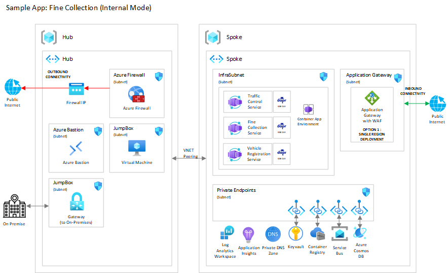
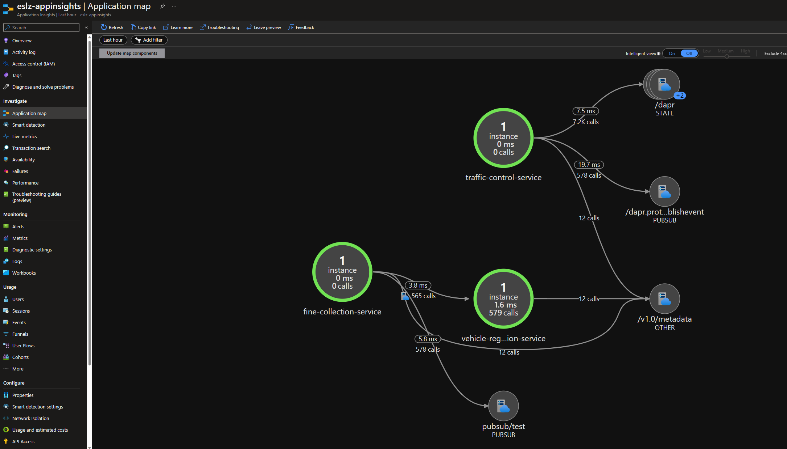

# Fine Collection Service Architecture

For the simulation of Fine Collection Service, 3 microservices are defined:

* `vehicle-registration-service`
* `fine-collection-service`
* `traffic-control-service`

]]

Each microservice corresponds to a container app, as shown on the diagram below.



## Supporting Services

Supporting services used for the container apps are the following:
* Azure Container Registry: used to store the image of the container apps;
* Azure Key Vault: used by Fine Collection Service to get the license key of the fine calculation engine using Dapr secret store `secretstore`;
* Azure Service Bus: used for communication between Traffic Control Service (i.e. the publisher) and Fine Collection Service (i.e. the subscriber);
* Azure Cosmos DB: used by Traffic Control Service to store the state of vehicle and compute the speed violation.

Both Azure Container Registry and Azure Key Vault are deployed by the landing zone accelerator in the spoke resource group. User managed identity `acaIdentity` is used to access these resource and is defined by the landing zone accelerator.

Azure Service Bus and Azure Cosmos DB are deployed in the spoke resource group by the sample app bicep template. They are created with a private endpoint and private DNS. Public network access is disabled for both resources.

## Dapr Components

There are 3 Darp compenents for Fine Collection Service sample app:

* `secretstore`: corresponds to [Dapr Secret Management building block](https://docs.dapr.io/developing-applications/building-blocks/secrets/). It is used by Fine Collection Service to retrieve the license key secret for the fine calculation engine.
* `pubsub`: corresponds to [Dapr Publish and Subscribe building block](https://docs.dapr.io/developing-applications/building-blocks/pubsub/pubsub-overview/). It used by:
  * Traffic Control Service to publish a *SpeedingViolation* payload when the average sped is above the speed-limit;
  * Fine Collection Service to subscribe to the topic *test* to consume speeding violation and computing corresponding fine.
* `statestore`: corresponds to [Dapr State Management building block](https://docs.dapr.io/developing-applications/building-blocks/state-management/state-management-overview/). It is used by Traffic Control Service to store and retrieve the state of a vehicle when one of its public endpoint is called.

## Service-to-Service invocation

Fine Collection Service received the license plate number when there is a speed violation. To get the information of the owner of the vehicle it calls Vehicle Registration Service using [Dapr Service Invocation building block](https://docs.dapr.io/developing-applications/building-blocks/service-invocation/service-invocation-overview/). Service discovery is used by Dapr side car of Fine Collection Service to find Vehicle Registration Service.

In the bicep template, the name of Vehicle Registration Service is passed to Fine Collection as an environment variable `VEHICLE_REGISTRATION_SERVICE`:

```
template: {
  containers: [
    {
      name: fineCollectionServiceName
      image: fineCollectionServiceImage
      resources: {
        cpu: json('0.5')
        memory: '1.0Gi'
      }
      env: [
        {
          name: 'VEHICLE_REGISTRATION_SERVICE'
          value: vehicleRegistrationServiceName
        }
      ]
    }
  ]
```

The value of this environment variable is the `App Id` of Vehicle Registration Service container app, here it is identical as Vehicle Registration Service container app name.

## Container Apps Scale Rule

If there is no message on Azure Service Bus topic *test*, Container Apps will scale down the number of replica of Fine Collection Service to 0. When a message is published on the topic, Container Apps will scale up the number of pods of Fine Collection Service.

The scale rule sets the minimum number of replica to 0 and the maximum number of replica to 5. It is defined in the file `sampleApps/javaFineCollectionService/bicep/modules/container-apps.bicep`:

```
scale: {
  minReplicas: 0
  maxReplicas: 5
  rules: [
    {
      name: 'service-bus-test-topic'
      custom: {
        type: 'azure-servicebus'
        auth: [
          {
            secretRef: 'service-bus-connection-string'
            triggerParameter: 'connection'
          }
        ]
        metadata: {
          subscriptionName: fineCollectionServiceName
          topicName: serviceBusTopicName
          messageCount: '10'
        }
      }
    }
  ]
}
```

`messageCount` is the number of messages in the topic that triggers the scaling up of the number of replica. If there is more than 10 messages in the topic, KEDA will scale up the number of replica. The scaler used for the scale rule is [KEDA Azure Service Bus scaler](https://keda.sh/docs/2.9/scalers/azure-service-bus/).

### Scale Rule with Secret Reference

 Container Apps scale rules only support secret reference. The secret reference is defined in the file `sampleApps/javaFineCollectionService/bicep/modules/container-apps.bicep`:

```
secrets: [
  {
    name: 'service-bus-connection-string'
    value: serviceBusTopicAuthorizationRule.listKeys().primaryConnectionString
  }
]
```

When service bus topic is created, an authorization rule is created with the name `TestTopicSharedAccessKey`. The secret reference is the primary connection string of this authorization rule. The only right that is granted to this authorization rule is `Listen` on the *test* topic.

## Managed identities

The managed identities used by the container apps are the following:
* User Managed Identity `acaIdentity` is used to access Azure Container Registry and Azure Key Vault. It is created by the landing zone accelerator in the spoke resource group.
* Traffic Control Service uses System Assigned Identity to access Azure Service Bus and Azure Cosmos DB. It is created by the sample app bicep template.
  * Traffic Control Service system assigned identity is granted the role `Azure Service Bus Data Sender` on the service bus topic.
  * Traffic Control Service system assigned identity is granted the role `Cosmos DB Built-in Data Contributor` on the Cosmos DB account. More information can be found [here](Cosmos DB Built-in Data Contributor).
* Fine Collection Service uses System Assigned Identity to access Azure Service Bus. It is created by the sample app bicep template. Fine Collection Service system assigned identity is granted the role `Azure Service Bus Data Receiver` on the service bus topic.

Guidelines on managed identities can be found [here](../../../../../docs/design-areas/identity.md).
  
## Exposing Traffic Control Service endpoints

Placeholder for Application Gateway. TODO Update this section

## Dapr Telemetry

By setting `daprAIInstrumentationKey` to `true`, Dapr will automatically send telemetry to Application Insights. The screenshot below shows the telemetry sent by Dapr to Application Insights.



## Camera Simulation

Camera simulation simulates traffic camera. It can be deployed in the container apps environment, in another Azure service or on a local machine. It is used to publish *VehicleRegistred* message to `/entrycam` and `/exitcam` endpoints of the Traffic Control Service. More information on how to deploy camera simultation can be found [here](./02-container-apps.md#camera-simulation).
